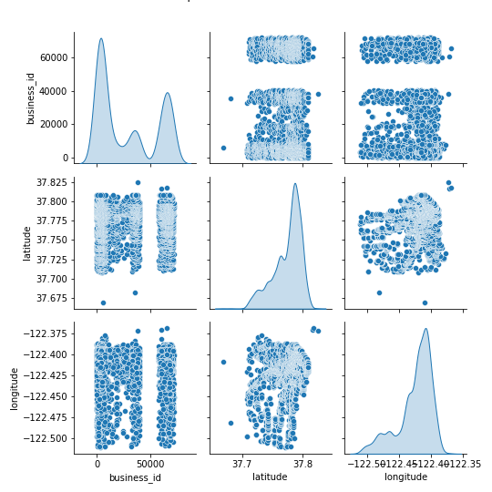
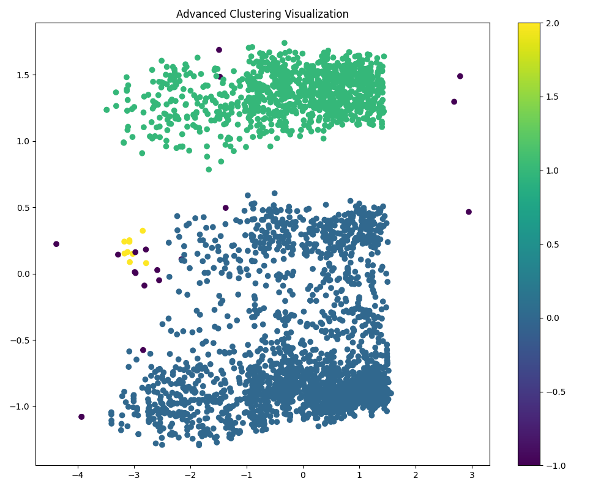
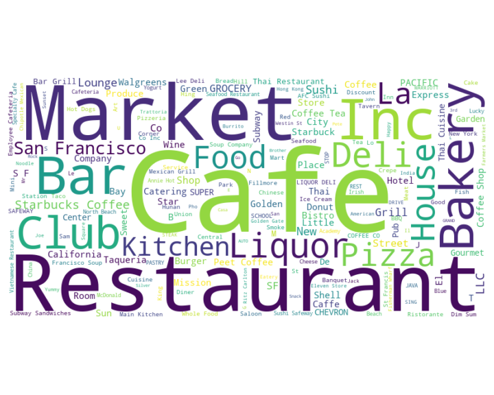

# Analysis Story with Images

# Data Analysis Story: Evaluating Local Eateries

## 1. The Data Received
- **Source**: The dataset analyzed comes from a CSV file named `eateries.csv`, located in the `python/tdsproject2/eateries` directory.
- **Content**: This dataset consists of information about 3,623 businesses with key attributes such as:
  - **business_id**: Unique identifier for each business.
  - **name**: Title of the business.
  - **latitude and longitude**: Coordinates indicating the geographical location of each business.
- **Data Structure**: 
  - No missing values were detected across the dataset.
  - The data comprises four columns: business_id (int64), name (object), latitude (float64), and longitude (float64).
  

## 2. The Analysis Carried Out
- **Descriptive Statistics**: 
  - Analyzed basic statistics including counts, averages, and distributions.
  - Notable observations:
    - business_id showed a mean of 28,216 and a maximum of 71,915.
    - Latitude ranged around 37.77 with longitudes around -122.42.
    
- **Visualization Techniques**: 
  - Employed visual aids to analyze trends and relationships between variables using pair plots.
  
- **KMeans Clustering**:
  - Conducted clustering to categorize businesses based on their geographical positions and attributes.
  - Utilized a KMeans algorithm to discover patterns and group businesses into clusters.
  

## 3. The Insights Discovered
- **Geographic Distribution**:
  - The analysis revealed many eateries clustered around specific latitudinal points (primarily around 37.71), suggesting the presence of active business hubs.
- **Cluster Analysis**:
  - Businesses predominantly fall into one major cluster (Cluster 0), indicating a common type of business in the area, while fewer businesses fall into Clusters 1 and 2, representing specialized services. 
- **Diverse Business Types**:
  - From markets to restaurants and gas stations, the dataset exhibited a rich variety of business types, signifying a mixed-use neighborhood catering to different community needs.

## 4. The Implications of Findings
- **Urban Planning**: Insights into business clustering can guide urban planners in identifying high-demand areas for potential investment or development.
- **Business Locator Applications**: The dataset can serve developers in creating applications to locate nearby businesses, particularly those that share characteristics with others in the same cluster.
- **Market Analysis**: By understanding the competitive landscape, businesses can tailor their strategies to appeal to consumer preferences in clustered areas.
- **Local Economic Health Assessment**: The mix of services and establishments in particular neighborhoods can indicate overall economic vitality and inform local economic development strategies.
- **Targeted Marketing Strategies**: Businesses in closely located clusters may benefit from differentiated marketing strategies to draw customers amidst competition.

In conclusion, this dataset reveals a comprehensive view of the local business landscape, highlighting opportunities for urban development, economic analysis, and strategic business positioning in the community.
