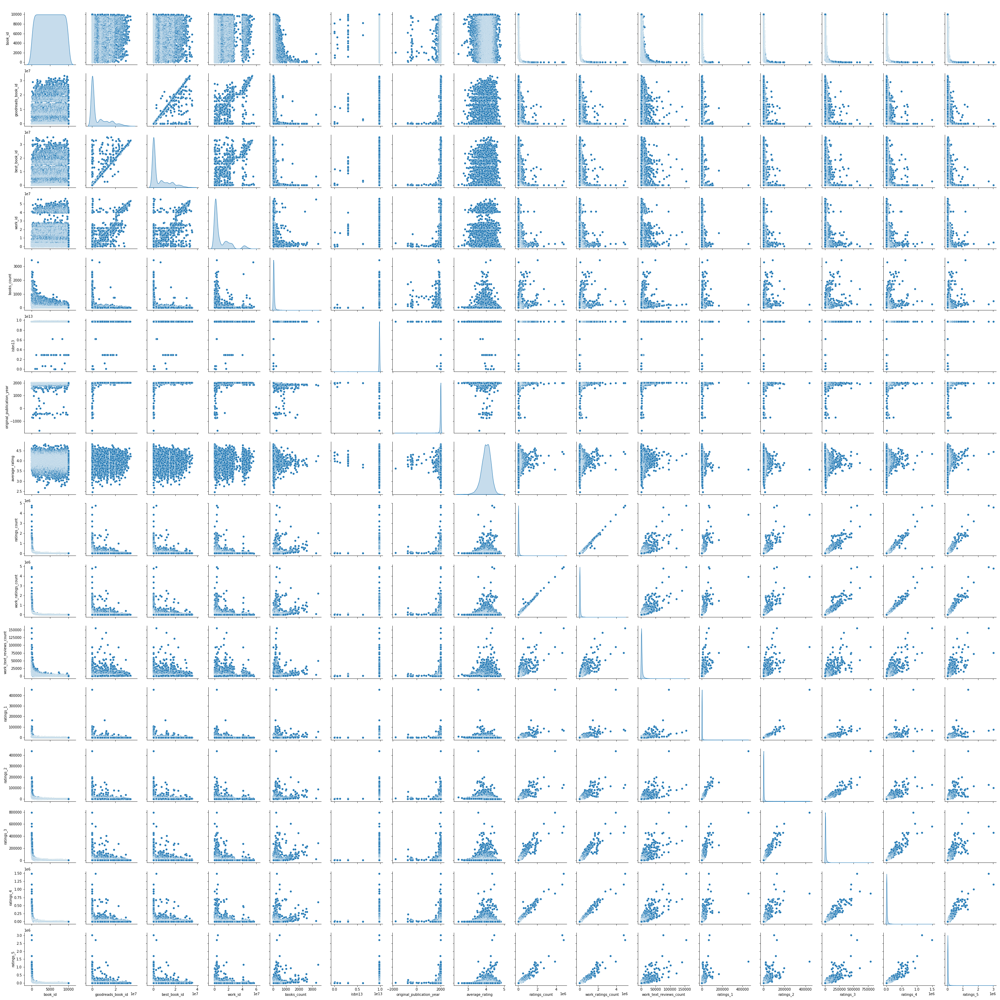
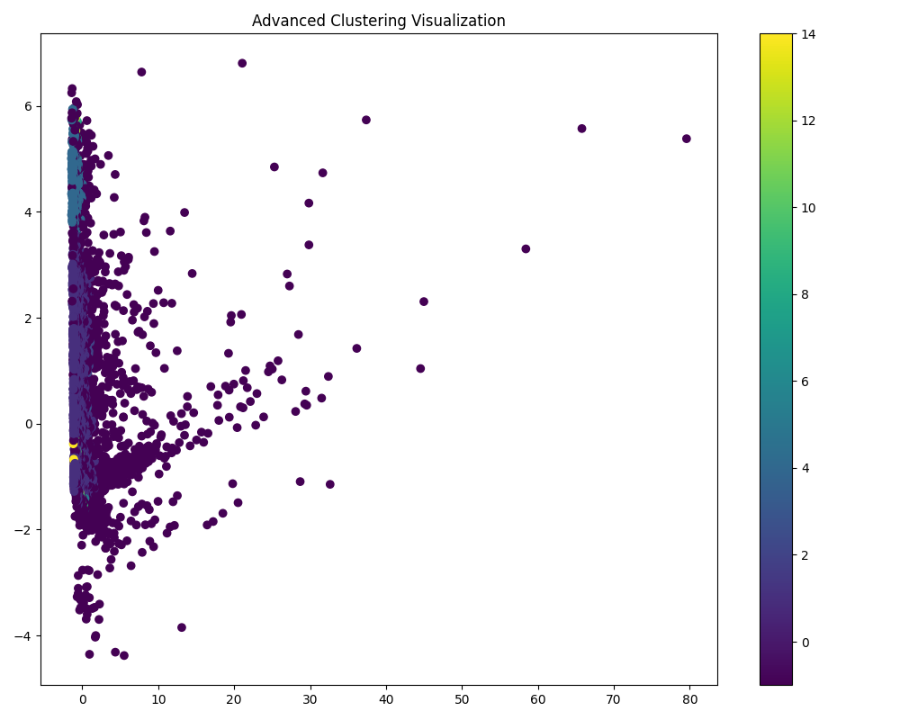
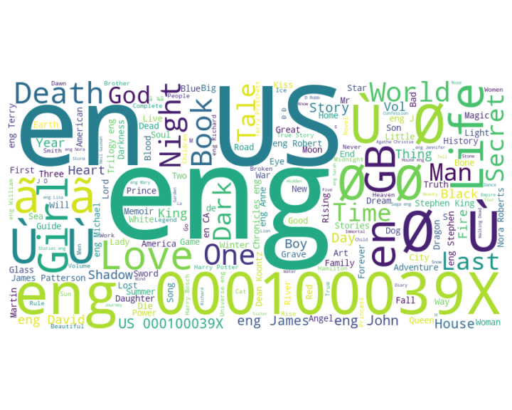

# Analysis Story with Images

# Data Analysis Report: Unveiling the Goodreads Dataset

## 1. The Data Received
- The dataset comprises **10,000 rows and 23 columns** of book information sourced from **Goodreads**, a popular online book database.
- Each entry represents a distinct book with metadata that includes:
  - **Identifiers**: `book_id`, `goodreads_book_id`, `best_book_id`, and `work_id`.
  - **Attributes**: `authors`, `original_publication_year`, `average_rating`, and `ratings_count`.
- Notable data discrepancies:
  - Missing values primarily exist in the fields like `isbn`, `isbn13`, `original_publication_year`, and `original_title`, indicating some incomplete entries.

## 2. The Analysis Carried Out
- The analytical approach utilized descriptive statistics to summarize key metrics in the dataset. This included calculating:
  - Mean, standard deviation, minimum, and maximum for various numeric fields.
  - Skewness and kurtosis to understand the distribution shape of key variables.
- **Dimensionality Reduction** techniques were applied to streamline the dataset to two dimensions for manageable analysis.
- **KMeans Clustering** was executed to group similar books based on ratings and other measurable features, helping identify patterns in reader preferences.

## 3. The Insights Discovered
- **Rating Patterns**:
  - High average ratings were observed for popular titles, indicating strong reader preference. For example, "*Harry Potter and the Philosopher's Stone*" had an above-average rating of **4.44**, supported by a significant **4 million ratings**.
  - Books like "*Twilight*" exhibited a polarization in literature reception, with a middling score of **3.57** indicating mixed opinions.
- **Engagement Metrics**:
  - A positive correlation was found between **ratings count** and **work text reviews count**, suggesting that popular books tend to receive more user engagement.
- **Trends Over Time**:
  - Classics maintained robust ratings, with titles like "*To Kill a Mockingbird*" demonstrating the lasting appeal of quality literature, suggesting timeless storytelling resonates with readers of all ages.

## 4. The Implications of Findings
- **Market Trends**:
  - The surge in popularity of fantasy and young adult genres indicates this demographic's preference for adventurous narratives. Publishers may consider these genres for future releases, catering to young audiences.
- **Literary Value**:
  - The enduring popularity of classic literature highlights the importance of upholding literary quality and could guide educational curriculums and reading programs in schools.
- **Marketing Strategies**:
  - Publishers and marketers could leverage high engagement metrics to identify books for targeted promotions, potentially enhancing sales and reader outreach.
- **Future Research**:
  - Suggested explorations include examining how demographic factors like language code influence book reception, which could illuminate more nuanced reader preferences across cultures.

This dataset offers a treasure trove of insights that can shape the understanding of reader behavior, genre popularity, and literary classics' relevance in contemporary society.