*Every story is complicated until it finds the right storyteller — Anonymous*

# Summary of findings

## Overview
File name: goodreads.csv

The file has 10000 rows and 23 columns

### Sample 5 rows from file, for context

Sample data:
| isbn       | authors                                 | original_title                                                                                      | title                                                                                               | language_code   | image_url                                                                                                                      | small_image_url                                                                                                              |
|:-----------|:----------------------------------------|:----------------------------------------------------------------------------------------------------|:----------------------------------------------------------------------------------------------------|:----------------|:-------------------------------------------------------------------------------------------------------------------------------|:-----------------------------------------------------------------------------------------------------------------------------|
|            | Brent Weeks                             | The Broken Eye                                                                                      | The Broken Eye (Lightbringer, #3)                                                                   | eng             |                               |                             |
| 786851473  | Eoin Colfer                             | The Arctic Incident                                                                                 | The Arctic Incident (Artemis Fowl, #2)                                                              | eng             |  |  |
| 147673190X | Jeff Hobbs                              | The Short and Tragic Life of Robert Peace: A Brilliant Young Man Who Left Newark for the Ivy League | The Short and Tragic Life of Robert Peace: A Brilliant Young Man Who Left Newark for the Ivy League | eng             |                               |                             |
|            | Jacob Grimm, Wilhelm Grimm, منى الخميسي | Grimms Märchen                                                                                      | Grimm's Fairy Tales                                                                                 | eng             |  |  |
| 1451651694 | Amanda Lindhout, Sara Corbett           | A House in the Sky                                                                                  | A House in the Sky                                                                                  | eng             |                               |                             |

### Descriptive analysis of the data

|       |   book_id |   goodreads_book_id |     best_book_id |         work_id |   books_count |         isbn13 |   original_publication_year |   average_rating |    ratings_count |   work_ratings_count |   work_text_reviews_count |   ratings_1 |   ratings_2 |   ratings_3 |      ratings_4 |       ratings_5 |
|:------|----------:|--------------------:|-----------------:|----------------:|--------------:|---------------:|----------------------------:|-----------------:|-----------------:|---------------------:|--------------------------:|------------:|------------:|------------:|---------------:|----------------:|
| count |  10000    |     10000           |  10000           | 10000           |      10000    | 9415           |                     9979    |         10000    |  10000           |      10000           |                  10000    |    10000    |    10000    |     10000   | 10000          | 10000           |
| mean  |   5000.5  |         5.2647e+06  |      5.47121e+06 |     8.64618e+06 |         75.71 |    9.75504e+12 |                     1981.99 |             4    |  54001.2         |      59687.3         |                   2919.96 |     1345.04 |     3110.89 |     11475.9 | 19965.7        | 23789.8         |
| std   |   2886.9  |         7.57546e+06 |      7.82733e+06 |     1.17511e+07 |        170.47 |    4.42862e+11 |                      152.58 |             0.25 | 157370           |     167804           |                   6124.38 |     6635.63 |     9717.12 |     28546.5 | 51447.4        | 79768.9         |
| min   |      1    |         1           |      1           |    87           |          1    |    1.9517e+08  |                    -1750    |             2.47 |   2716           |       5510           |                      3    |       11    |       30    |       323   |   750          |   754           |
| 25%   |   2500.75 |     46275.8         |  47911.8         |     1.00884e+06 |         23    |    9.78032e+12 |                     1990    |             3.85 |  13568.8         |      15438.8         |                    694    |      196    |      656    |      3112   |  5405.75       |  5334           |
| 50%   |   5000.5  |    394966           | 425124           |     2.71952e+06 |         40    |    9.78045e+12 |                     2004    |             4.02 |  21155.5         |      23832.5         |                   1402    |      391    |     1163    |      4894   |  8269.5        |  8836           |
| 75%   |   7500.25 |         9.38223e+06 |      9.63611e+06 |     1.45177e+07 |         67    |    9.78083e+12 |                     2011    |             4.18 |  41053.5         |      45915           |                   2744.25 |      885    |     2353.25 |      9287   | 16023.5        | 17304.5         |
| max   |  10000    |         3.32886e+07 |      3.55342e+07 |     5.63996e+07 |       3455    |    9.79001e+12 |                     2017    |             4.82 |      4.78065e+06 |          4.94236e+06 |                 155254    |   456191    |   436802    |    793319   |     1.4813e+06 |     3.01154e+06 |

## Missing values report

|                           |   Missing Values Count |   Missing Percentage (%) |
|:--------------------------|-----------------------:|-------------------------:|
| book_id                   |                      0 |                     0    |
| goodreads_book_id         |                      0 |                     0    |
| best_book_id              |                      0 |                     0    |
| work_id                   |                      0 |                     0    |
| books_count               |                      0 |                     0    |
| isbn                      |                    700 |                     7    |
| isbn13                    |                    585 |                     5.85 |
| authors                   |                      0 |                     0    |
| original_publication_year |                     21 |                     0.21 |
| original_title            |                    585 |                     5.85 |
| title                     |                      0 |                     0    |
| language_code             |                   1084 |                    10.84 |
| average_rating            |                      0 |                     0    |
| ratings_count             |                      0 |                     0    |
| work_ratings_count        |                      0 |                     0    |
| work_text_reviews_count   |                      0 |                     0    |
| ratings_1                 |                      0 |                     0    |
| ratings_2                 |                      0 |                     0    |
| ratings_3                 |                      0 |                     0    |
| ratings_4                 |                      0 |                     0    |
| ratings_5                 |                      0 |                     0    |
| image_url                 |                      0 |                     0    |
| small_image_url           |                      0 |                     0    |

### Word Cloud Analysis
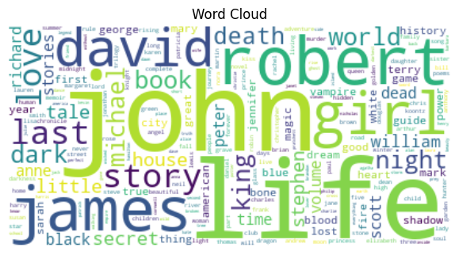

Some of these most frequently words are: john, life, robert, james, girl, david, story, last, love, night, world, book, king, michael, dark, death, little, secret, stephen, tale.

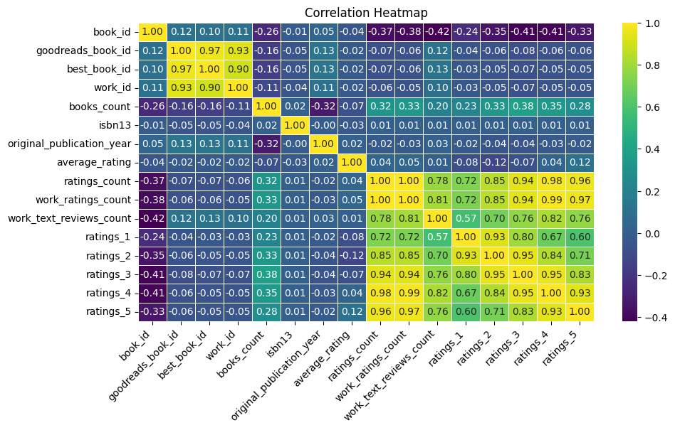

This heatmap visualizes the correlation between numerical features.

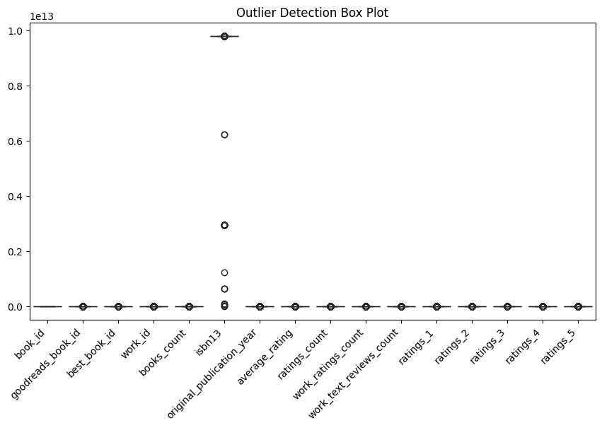

This boxplot highlights potential outliers for numerical features.

### Outlier Summary:

|                |   book_id |   goodreads_book_id |   best_book_id |       work_id |   books_count |        isbn13 |   original_publication_year |   average_rating |   ratings_count |   work_ratings_count |   work_text_reviews_count |   ratings_1 |   ratings_2 |   ratings_3 |   ratings_4 |   ratings_5 |
|:---------------|----------:|--------------------:|---------------:|--------------:|--------------:|--------------:|----------------------------:|-----------------:|----------------:|---------------------:|--------------------------:|------------:|------------:|------------:|------------:|------------:|
| lower_bound    |   -4998.5 |        -1.39576e+07 |   -1.43344e+07 |  -1.92545e+07 |           -43 |   9.77954e+12 |                      1958.5 |            3.355 |        -27658.4 |             -30275.6 |                  -2381.38 |      -837.5 |    -1889.88 |     -6150.5 |    -10520.9 |    -12621.8 |
| upper_bound    |   14999.5 |         2.33861e+07 |    2.40184e+07 |   3.47811e+07 |           133 |   9.7816e+12  |                      2042.5 |            4.675 |         82280.6 |              91629.4 |                   5819.62 |      1918.5 |     4899.12 |     18549.5 |     31950.1 |     35260.2 |
| outliers_count |       0   |       345           |  357           | 601           |           844 | 556           |                      1031   |          158     |          1163   |               1143   |                   1005    |      1140   |     1156    |      1149   |      1131   |      1158   |

### Time Series Analysis
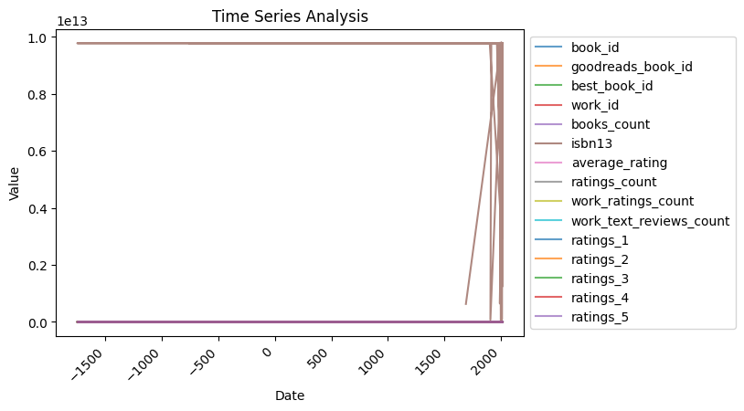

This line plot shows trends over time for numerical data with a `Date` column.

<!--### Geographic Distribution
No geographic data found
-->

<!--### Network Analysis
No network analysis generated
-->

### Categorical Data Distribution
The following plots show the distribution of categorical data:

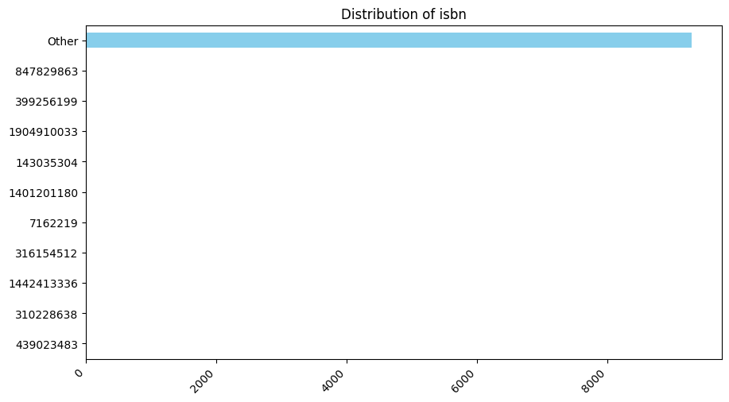

This bar chart shows the distribution of `isbn` column.

Sample 5 rows from provided data, for context to Categorical distribution 
|       isbn |
|-----------:|
|  451236718 |
|  743464117 |
|  544303164 |
| 1841490237 |
| 1421506270 |
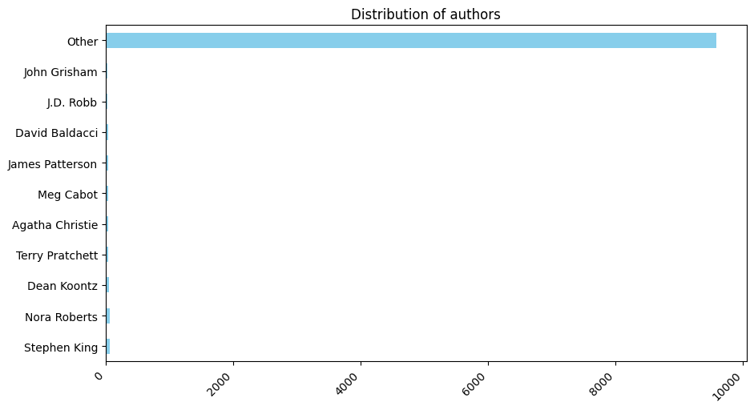

This bar chart shows the distribution of `authors` column.

Sample 5 rows from provided data, for context to Categorical distribution 
| authors               |
|:----------------------|
| Norman Maclean        |
| Kevin J. Anderson     |
| James Fenimore Cooper |
| Wally Lamb            |
| Patrick O'Brian       |
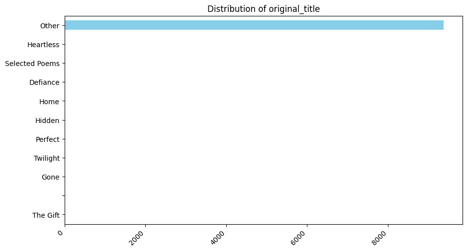

This bar chart shows the distribution of `original_title` column.

Sample 5 rows from provided data, for context to Categorical distribution 
| original_title                                                          |
|:------------------------------------------------------------------------|
| Best Friends for Never (The Clique, #2)                                 |
| The Body Snatchers                                                      |
| Van Gogh: The Life                                                      |
| Deceptively Delicious: Simple Secrets to Get Your Kids Eating Good Food |
| Healthy Sleep Habits, Happy Child                                       |

### Numerical Data Histograms

This histogram plot represents the distribution of `book_id` column.

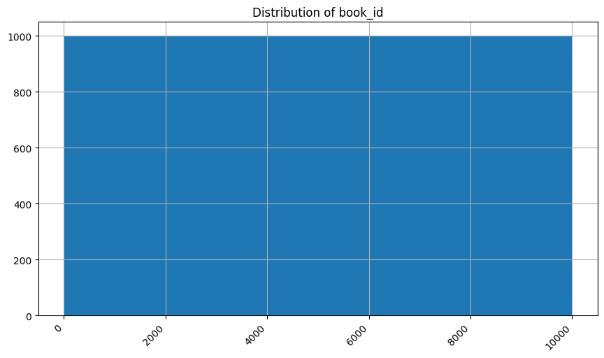

This histogram plot represents the distribution of `goodreads_book_id` column.

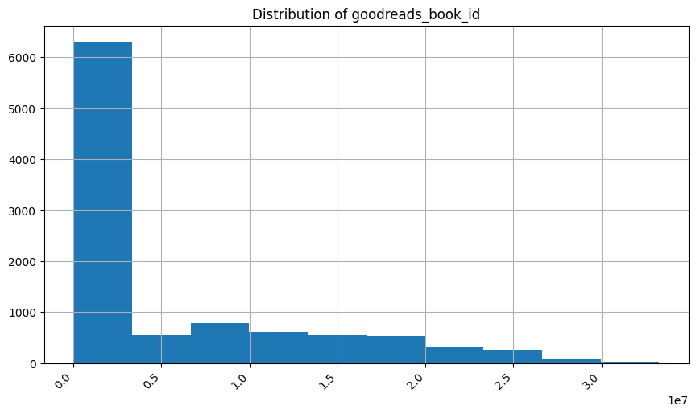

This histogram plot represents the distribution of `best_book_id` column.

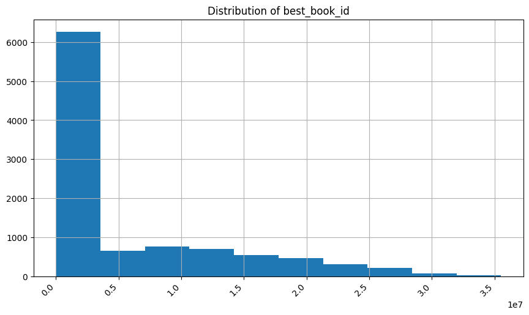

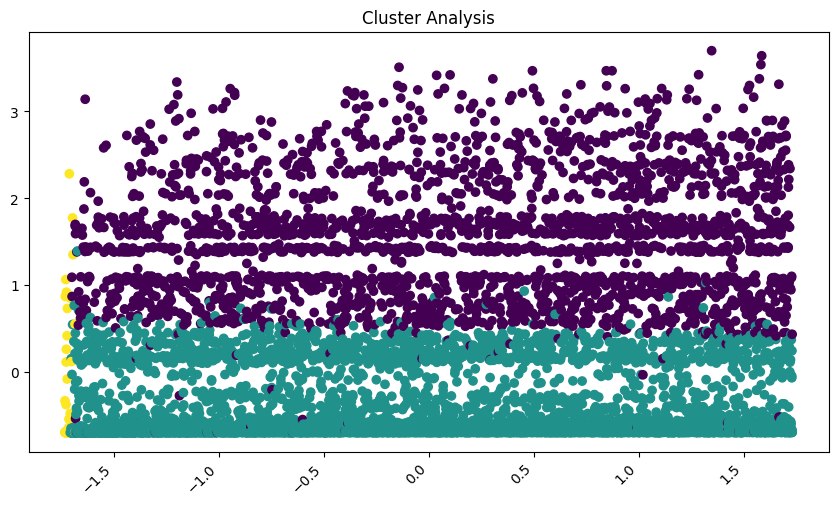

This scatter plot represents the cluster analysis results.

Sample data with clusters:

|   book_id |   goodreads_book_id |   best_book_id |   work_id |   books_count | isbn       |      isbn13 | authors                    |   original_publication_year | original_title                                                             | title                                                                      | language_code   |   average_rating |   ratings_count |   work_ratings_count |   work_text_reviews_count |   ratings_1 |   ratings_2 |   ratings_3 |   ratings_4 |   ratings_5 | image_url                                                                                | small_image_url                                                                        |   Cluster |
|----------:|--------------------:|---------------:|----------:|--------------:|:-----------|------------:|:---------------------------|----------------------------:|:---------------------------------------------------------------------------|:---------------------------------------------------------------------------|:----------------|-----------------:|----------------:|---------------------:|--------------------------:|------------:|------------:|------------:|------------:|------------:|:-----------------------------------------------------------------------------------------|:---------------------------------------------------------------------------------------|----------:|
|       455 |               42155 |          42155 |   1470371 |            43 | 312323867  | 9.78031e+12 | Emily Giffin               |                        2005 | Something Blue                                                             | Something Blue (Darcy & Rachel, #2)                                        | en-US           |             3.92 |          172417 |               178529 |                      6646 |        2164 |        9144 |       44161 |       68226 |       54834 | https://s.gr-assets.com/assets/nophoto/book/111x148-bcc042a9c91a29c1d680899eff700a03.png | https://s.gr-assets.com/assets/nophoto/book/50x75-a91bf249278a81aabab721ef782c4a74.png |         1 |
|      8566 |            13333093 |       13333093 |  18541011 |            20 | 758278438  | 9.78076e+12 | Ellen Marie Wiseman        |                        2012 | The Plum Tree                                                              | The Plum Tree                                                              | eng             |             4.02 |            8479 |                10909 |                      1194 |         151 |         516 |        2094 |        4352 |        3796 | https://images.gr-assets.com/books/1339438508m/13333093.jpg                              | https://images.gr-assets.com/books/1339438508s/13333093.jpg                            |         0 |
|      7636 |             7011879 |        7011879 |   7257194 |             7 | 8188575658 | 9.78819e+12 | Durjoy Datta, Maanvi Ahuja |                        2008 | of course i love you                                                       | Of Course I Love You...! Till I Find Someone Better...                     | en-GB           |             3.21 |            6671 |                 9661 |                       301 |        1059 |        1663 |        2910 |        2203 |        1826 | https://images.gr-assets.com/books/1274597947m/7011879.jpg                               | https://images.gr-assets.com/books/1274597947s/7011879.jpg                             |         1 |
|      8640 |               93575 |          93575 |    341789 |            72 | 61043494   | 9.78006e+12 | Dorothy L. Sayers          |                        1935 | Gaudy Night                                                                | Gaudy Night (Lord Peter Wimsey, #12)                                       | eng             |             4.26 |           14750 |                16378 |                      1203 |         166 |         526 |        2267 |        5352 |        8067 | https://s.gr-assets.com/assets/nophoto/book/111x148-bcc042a9c91a29c1d680899eff700a03.png | https://s.gr-assets.com/assets/nophoto/book/50x75-a91bf249278a81aabab721ef782c4a74.png |         1 |
|      8943 |            18213403 |       18213403 |  25637147 |            51 | 162779073X | 9.78163e+12 | Glenn Greenwald            |                        2014 | No Place to Hide: Edward Snowden, the NSA, and the U.S. Surveillance State | No Place to Hide: Edward Snowden, the NSA, and the U.S. Surveillance State | eng             |             4.08 |            8366 |                10364 |                      1130 |         170 |         381 |        1772 |        4188 |        3853 | https://images.gr-assets.com/books/1383352779m/18213403.jpg                              | https://images.gr-assets.com/books/1383352779s/18213403.jpg                            |         0 |

<!--### pca analysis
Error during pca analysis
-->

[]