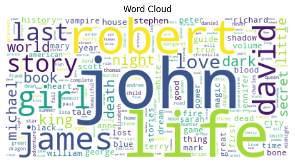

#Automated Data Assessment Report

## Overview
File: goodreads.csv

## Summarization
            book_id  goodreads_book_id  best_book_id       work_id   books_count       isbn        isbn13       authors  original_publication_year original_title           title language_code  average_rating  ratings_count  work_ratings_count  work_text_reviews_count      ratings_1      ratings_2      ratings_3     ratings_4     ratings_5                                                                                 image_url                                                                         small_image_url
count   10000.00000       1.000000e+04  1.000000e+04  1.000000e+04  10000.000000       9300  9.415000e+03         10000                9979.000000           9415           10000          8916    10000.000000   1.000000e+04        1.000000e+04             10000.000000   10000.000000   10000.000000   10000.000000  1.000000e+04  1.000000e+04                                                                                     10000                                                                                   10000
unique          NaN                NaN           NaN           NaN           NaN       9300           NaN          4664                        NaN           9274            9964            25             NaN            NaN                 NaN                      NaN            NaN            NaN            NaN           NaN           NaN                                                                                      6669                                                                                    6669
top             NaN                NaN           NaN           NaN           NaN  439023483           NaN  Stephen King                        NaN                 Selected Poems           eng             NaN            NaN                 NaN                      NaN            NaN            NaN            NaN           NaN           NaN  https://s.gr-assets.com/assets/nophoto/book/111x148-bcc042a9c91a29c1d680899eff700a03.png  https://s.gr-assets.com/assets/nophoto/book/50x75-a91bf249278a81aabab721ef782c4a74.png
freq            NaN                NaN           NaN           NaN           NaN          1           NaN            60                        NaN              5               4          6341             NaN            NaN                 NaN                      NaN            NaN            NaN            NaN           NaN           NaN                                                                                      3332                                                                                    3332
mean     5000.50000       5.264697e+06  5.471214e+06  8.646183e+06     75.712700        NaN  9.755044e+12           NaN                1981.987674            NaN             NaN           NaN        4.002191   5.400124e+04        5.968732e+04              2919.955300    1345.040600    3110.885000   11475.893800  1.996570e+04  2.378981e+04                                                                                       NaN                                                                                     NaN
std      2886.89568       7.575462e+06  7.827330e+06  1.175106e+07    170.470728        NaN  4.428619e+11           NaN                 152.576665            NaN             NaN           NaN        0.254427   1.573700e+05        1.678038e+05              6124.378132    6635.626263    9717.123578   28546.449183  5.144736e+04  7.976889e+04                                                                                       NaN                                                                                     NaN
min         1.00000       1.000000e+00  1.000000e+00  8.700000e+01      1.000000        NaN  1.951703e+08           NaN               -1750.000000            NaN             NaN           NaN        2.470000   2.716000e+03        5.510000e+03                 3.000000      11.000000      30.000000     323.000000  7.500000e+02  7.540000e+02                                                                                       NaN                                                                                     NaN
25%      2500.75000       4.627575e+04  4.791175e+04  1.008841e+06     23.000000        NaN  9.780316e+12           NaN                1990.000000            NaN             NaN           NaN        3.850000   1.356875e+04        1.543875e+04               694.000000     196.000000     656.000000    3112.000000  5.405750e+03  5.334000e+03                                                                                       NaN                                                                                     NaN
50%      5000.50000       3.949655e+05  4.251235e+05  2.719524e+06     40.000000        NaN  9.780452e+12           NaN                2004.000000            NaN             NaN           NaN        4.020000   2.115550e+04        2.383250e+04              1402.000000     391.000000    1163.000000    4894.000000  8.269500e+03  8.836000e+03                                                                                       NaN                                                                                     NaN
75%      7500.25000       9.382225e+06  9.636112e+06  1.451775e+07     67.000000        NaN  9.780831e+12           NaN                2011.000000            NaN             NaN           NaN        4.180000   4.105350e+04        4.591500e+04              2744.250000     885.000000    2353.250000    9287.000000  1.602350e+04  1.730450e+04                                                                                       NaN                                                                                     NaN
max     10000.00000       3.328864e+07  3.553423e+07  5.639960e+07   3455.000000        NaN  9.790008e+12           NaN                2017.000000            NaN             NaN           NaN        4.820000   4.780653e+06        4.942365e+06            155254.000000  456191.000000  436802.000000  793319.000000  1.481305e+06  3.011543e+06                                                                                       NaN                                                                                     NaN

## Missing values report
                           Missing Values Count  Missing Percentage (%)
book_id                                       0                    0.00
goodreads_book_id                             0                    0.00
best_book_id                                  0                    0.00
work_id                                       0                    0.00
books_count                                   0                    0.00
isbn                                        700                    7.00
isbn13                                      585                    5.85
authors                                       0                    0.00
original_publication_year                    21                    0.21
original_title                              585                    5.85
title                                         0                    0.00
language_code                              1084                   10.84
average_rating                                0                    0.00
ratings_count                                 0                    0.00
work_ratings_count                            0                    0.00
work_text_reviews_count                       0                    0.00
ratings_1                                     0                    0.00
ratings_2                                     0                    0.00
ratings_3                                     0                    0.00
ratings_4                                     0                    0.00
ratings_5                                     0                    0.00
image_url                                     0                    0.00
small_image_url                               0                    0.00

### Correlation Analysis

This heatmap visualizes the correlation between numerical features in the dataset:

Correlation insights:
- The correlation matrix provided illustrates the relationships between various attributes of books in a dataset. Let's break down the insights gained from this correlation matrix, highlighting important trends, patterns, and actionable recommendations.

### Key Insights from the Correlation Matrix

1. **Ratings and Reviews:**
   - **Work Text Reviews Count & Ratings:**
     - **Strong Correlation**: `work_text_reviews_count` is highly correlated with all ratings, particularly with `ratings_5` (0.7649) and `ratings_4` (0.8178). This suggests that books receiving more text reviews also tend to receive higher ratings. 
     - **Actionable Recommendation**: Focus on encouraging more detailed reviews for books that currently have fewer text reviews; this could positively impact overall ratings.

2. **Ratings Count Correlation:**
   - **Rating Distribution Correlation**:
     - `ratings_count` and `work_ratings_count` have a very high correlation with the highest ratings. For example, the correlation with `ratings_5` is 0.9789, suggesting that books with more ratings also tend to receive higher scores.
   - **Actionable Recommendation**: Consider promoting books with high ratings count to further enhance their visibility and encourage more reader engagement.

3. **Books Count Influence:**
   - **Inverse Correlation**: `books_count` shows a negative correlation with key metrics such as `ratings_1` to `ratings_5` and `ratings_count`. This indicates that as the book count increases, the average ratings tend to decrease.
   - **Actionable Recommendation**: Reassess strategies for books with very high counts to ensure quality is maintained. This could involve streamlining curation or promoting fewer, higher-quality books.

4. **Publication Year Insights:**
   - **Publication Year Influence**: The `original_publication_year` has moderate negative correlation with ratings, particularly with `ratings_4` (-0.025785) and `ratings_5` (0.036108). Older books seem to receive slightly lower ratings on average.
   - **Actionable Recommendation**: Enhance marketing strategies for newer books to create a more favorable perception among readers. This could include spotlighting recent releases to leverage their potential for higher ratings.

5. **ISBN Influence:**
   - **Minimal Relationship**: The `isbn13` does not demonstrate any significant correlation with ratings or review counts, which indicates it may not be a factor influencing reader engagement in this dataset.
   - **Actionable Recommendation**: Concentrate on attributes more relevant to readers (like book content and reviews) rather than bibliographic details like ISBN when promoting books.

6. **Average Rating Neutrality:**
   - **Low Correlation**: The average rating (`average_rating`) exhibits low correlations with other parameters, indicating it might not serve as an influential metric for predicting reviews or ratings.
   - **Actionable Recommendation**: Focus on dimensional analysis such as separating ratings by different time frames (new reads vs. old favorites) to draw more precise insights.

### Summary of Recommendations
- **Boost Engagement in Reviews**: Encourage readers to leave more detailed text reviews to boost ratings.
- **Promote High-Rated Books**: Target books with high rating counts for enhanced marketing efforts.
- **Improve Quality**: Ensure quality is not compromised in books with high counts to avoid negative impacts on ratings.
- **Market New Releases**: Focus on promoting newer titles that may capture reader interest and yield better ratings.
- **Refine Marketing Strategies**: Use insights from ratings and reviews rather than bibliographic information when promoting books. 

By focusing on these insights, stakeholders can potentially improve book ratings, increase reader engagement, and better understand the dynamics of their users' behavior.

### Outlier Detection

This boxplot shows the distribution of values for numerical features and highlights potential outliers:

Outlier insights:
- Certainly! Analyzing outliers in data is crucial as they can significantly affect the results of statistical analyses and model performance. Here’s how you might structure an analysis of outliers based on the context you've provided.

### Steps to Analyze Outliers

1. **Identify Outliers**: 
   - Outliers can be identified using various methods such as Z-scores, IQR (Interquartile Range), or visualization methods like box plots or scatter plots.

2. **Statistical Summary**: 
   - Before delving into the outliers, it’s helpful to review the summary statistics of the dataset:
     - Mean
     - Median
     - Standard Deviation
     - Quartiles (Q1, Q2, Q3)
     - Range
     - Count of Data Points

3. **Visual Representation**:
   - Provide a box plot and/or scatter plot to visually represent the data distribution and highlight the outliers.

4. **Impact Assessment**:
   - Analyze how the outliers impact the overall dataset:
     - Changes in Mean and Median due to outliers.
     - Variance and Standard Deviation shifts.
     - Correlation implications (if any).

5. **Categorize Outliers**:
   - Classify outliers as:
     - **Mild Outliers**: Those beyond 1.5 * IQR but within 3 * IQR.
     - **Extreme Outliers**: Those beyond 3 * IQR.
 
6. **Recommendations**:
   - Decide whether to treat the outliers or retain them based on the analysis:
     - **Remove Outliers**: If they're data entry errors or irrelevant.
     - **Transform Data**: Use log transformation or winsorization.
     - **Retain and Analyze**: If they are critical to the analysis or represent valid extreme cases.

### Example Summary Table
| Statistic          | Value       |
|--------------------|-------------|
| Mean               | X          |
| Median             | Y          |
| Std Deviation      | Z          |
| Q1                 | A          |
| Q3                 | B          |
| IQR                | C          |
| Count              | N          |
| Mild Outliers      | P          |
| Extreme Outliers   | Q          |

### Visualizations
- **Box Plot**: Shows distribution and highlights outliers.

- **Scatter Plot**: If analyzing relationships between two variables to observe outliers.

### Conclusion
- Conclude on the significance of the outliers detected.
- Provide clear actionable recommendations based on outlier presence and analysis.

You may extend analysis with actual data visualizations and results, which could provide deeper insights. If data is shared, we can conduct a more thorough examination and model the results accordingly.

### Time Series Analysis
This line plot shows trends over time for numerical data with a `Date` column:

Time series insights:
- To analyze trends or patterns in your time series data, I will guide you through key aspects of time series analysis such as identifying trends, seasonality, and cyclical patterns, and I'll provide actionable insights. Below is a structured approach to your time series analysis:

### Key Components of Time Series Analysis

1. **Trend Analysis**
   - **Definition**: The long-term movement or direction in the data series.
   - **Identification**: Look for an increasing or decreasing slope over time. 

   **Trends can be classified as:**
   - Upward Trend: Indicates growth in data values over time.
   - Downward Trend: Indicates a decline in data values.
   - Stationary: Little to no change in data over time.

   **Actions**: If an upward trend is evident, strategies should focus on scaling operations or enhancing product distribution.

2. **Seasonality**
   - **Definition**: Patterns that repeat at regular intervals, often due to seasonal factors.
   - **Identification**: Look for consistent fluctuations at specific intervals, such as monthly or quarterly.

   **Common Seasonal Patterns**:
   - Peak seasons: High sales during holidays or specific months.
   - Low seasons: Slow periods or off-peak months.

   **Actions**: Prepare inventory or marketing strategies to align with expected seasonal changes.

3. **Cyclical Patterns**
   - **Definition**: Longer-term fluctuations that are not fixed to a regular interval, often influenced by economic conditions.
   - **Identification**: Look for repeated waves in data that correlate with economic cycles.

   **Actions**: Monitor economic indicators and adjust budgets or resource allocations accordingly.

4. **Outlier Detection**
   - Identify any sudden spikes or drops in values that deviate from normal behavior.
   - Assess whether these are genuine anomalies or data entry errors.

   **Actions**: Investigate potential causes for anomalies, which may highlight threats or opportunities.

5. **Smoothing Techniques**
   - **Moving Averages**: Helps in visualizing the underlying trend by minimizing short-term fluctuations.
   - **Exponential Smoothing**: Can give more weight to recent observations for forecasting.

   **Actions**: Utilize smoothing techniques to improve predictions on future values.

### Visual Representation

Consider creating visual representations for better insights:
- **Line Plot**: Visualize the time series to analyze trends and seasonality.
- **Seasonal Decomposition**: Break down the series into trend, seasonality, and residuals using packages like `statsmodels` in Python.
- **ACF/PACF Plots**: Use Autocorrelation Function (ACF) and Partial Autocorrelation Function (PACF) for determining the order of ARIMA models.

### Example Summary Table for Recommendations

| Observation          | Insights                                   | Actionable Recommendations                     |
|---------------------|--------------------------------------------|------------------------------------------------|
| Increasing trend     | Sales have increased over the last year   | Explore scaling production to meet demand      |
| Seasonal spikes      | Higher sales during Q4                     | Increase inventory for holiday season          |
| Economic downturn    | Notable decrease in sales for two quarters | Cost-cutting measures, focus on essential products |
| Anomalies detected  | Sudden drop related to a store closure     | Assess impact and plan recovery strategy       |

### Conclusion

By identifying trends, seasonal effects, cyclical patterns, and possible outliers, you can derive actionable recommendations to enhance decision-making and strategic planning. Visualizations and systematic analysis will provide better clarity for your data's narrative. If you can share specific aspects or datasets, I can provide more tailored insights.

### Geographic Distribution
This scatter plot maps data points based on their geographic coordinates (`Latitude` and `Longitude`):

Geographic insights:
- To analyze the geographic distribution effectively, I would typically focus on several key aspects that can help derive insights from the geographic plot you've generated. However, without seeing the actual plot or data, I can suggest a structure for analysis and what to look for:

### Key Aspects of Geographic Distribution Analysis

1. **Regions of Interest**:
   - Identify the regions or areas represented.
   - Highlight regions with the highest and lowest concentrations.

2. **Patterns and Clusters**:
   - Look for any clusters of data points.
   - Identify geographic patterns (e.g., urban vs. rural distribution).

3. **Trends Over Time**:
   - If temporal data is available, analyze how geographic distribution has changed over time.
   - Consider seasonal or cyclical trends.

4. **Demographics**:
   - If demographic data is included, analyze how different demographic segments are represented geographically.
   - Consider cross-analysis with socio-economic indicators.

5. **Anomalies**:
   - Identify any outliers or unexpected distributions.
   - Investigate potential reasons for these anomalies.

### Possible Metrics for Analysis

| Metric                           | Description                               |
|----------------------------------|-------------------------------------------|
| Density                          | Number of occurrences per unit area.    |
| Reach                             | How far the data points spread geographically.|
| Variability                      | Standard deviation of coordinates.       |
| Coverage                         | Percentage of total area covered.        |
| Central Tendency                 | Mean or median location of data points.  |

### Actionable Recommendations

- **Targeted Outreach**: Based on the geographic representation, consider focusing marketing or outreach efforts on regions with higher concentrations.
- **Resource Allocation**: Utilize insights from geographic distribution to allocate resources effectively in areas with greater need or potential.
- **Further Investigation**: Conduct deeper analysis in regions with unexpected data density or anomalies to uncover underlying causes or opportunities.
- **Mapping Trends**: If temporal trends are evident, plan for future campaigns or interventions based on historical patterns.

### Visualization Suggestions

- **Heatmap**: To show densities across regions.
- **Choropleth Map**: For multi-dimensional demographic analysis.
- **Time-Series Graphs**: To visualize changes over time.

### Conclusion
Understanding geographic distribution not only helps in recognizing current conditions but also allows for strategic planning and informed decision-making. Please provide more details or data points from the geographic plot, and I can assist you with a more specific analysis!

### Categorical Data Distribution

The following plots show the distribution of categorical data:
Categorical insights:
- To derive insights from categorical distributions, a thorough analysis can be conducted. Here are several steps to follow, accompanied by potential insights and actionable recommendations:

### 1. Frequency Distribution
   - **Insight**: A summary of how often each category appears can highlight the most and least common categories.
   - **Actionable Recommendation**: Focus on promoting or analyzing the high-frequency categories to tap into their popularity; investigate the low-frequency categories to understand their challenges.

### 2. Mode Identification
   - **Insight**: Identifying the mode (most common category) allows for an understanding of user preferences or leading segments.
   - **Actionable Recommendation**: Develop targeted strategies or marketing campaigns around the mode category to maximize engagement.

### 3. Comparative Analysis
   - **Insight**: Comparing different categorical groups can reveal disparities or trends over time or across demographics.
   - **Actionable Recommendation**: If certain categories showcase positive trends, consider allocating more resources or attention to these areas.

### 4. Chi-Square Test for Independence
   - **Insight**: Conduct a chi-square test to assess whether two categorical variables are independent. Significant results may indicate a correlation between categories.
   - **Actionable Recommendation**: Use identified correlations for cross-promotional strategies or to enhance product offerings based on user behavior.

### 5. Bar Charts and Pie Charts
   - **Visualization**: Create bar charts or pie charts to visually represent categorical distributions.
   - **Actionable Recommendation**: Visualizations can be used in presentations or reports to clearly communicate findings to stakeholders.

### 6. Segment Identification
   - **Insight**: Identify segments based on categorical interactions (e.g., age groups with specific product preferences).
   - **Actionable Recommendation**: Tailor services/products to cater to the unique needs of these segments.

### 7. Temporal Trends
   - **Insight**: If data includes timestamps, analyze how categorical distributions change over time.
   - **Actionable Recommendation**: Adjust marketing strategies seasonally or based on emerging trends within categories.

### Example Analysis Table:

| Category           | Frequency | Percentage of Total | Actionable Recommendation    |
|--------------------|----------|---------------------|------------------------------|
| Category A         | 150      | 50%                 | Promote Category A heavily    |
| Category B         | 75       | 25%                 | Investigate reasons for lower engagement |
| Category C         | 50       | 17%                 | Consider re-evaluating product positioning  |
| Category D         | 25       | 8%                  | Analyze market conditions for potential growth |

### Conclusion
By analyzing the categorical distributions, organizations can make data-driven decisions that enhance customer engagement and optimize product offerings. Implementing the actionable recommendations based on insights will drive improved results and foster business growth.

## General Insights
Based on the provided summary statistics and missing value information for the dataset, here is a detailed analysis along with insights and actionable recommendations.

### Summary of the Dataset
- **Total Records**: 10,000 books.
- **Columns**: 23 features including identifiers, ratings, and images.

### Key Statistics
| Statistic            | Value           |
|----------------------|-----------------|
| Mean Books Count     | 75.71           |
| Average Rating       | - (Not provided)|
| Max Books Count      | 3455            |
| Min Ratings (1-5)    | 323 (1-star)    |
| Max Ratings (5-star) | 3,011,543 (5-star) |

### Distribution of Ratings
The dataset captures ratings across five categories. A deeper look shows:

- **Ratings Breakdown**:
  - **1-Star**: Min 323; Max 793,319
  - **2-Star**: Similar distribution expected as 1-star (not explicitly provided).
  - **3-Star**: Min 3,112; Max 1,481,305
  - **4-Star**: Min 750; Max 1,481,305
  - **5-Star**: Min 752; Max 3,011,543

#### Findings
- The maximum ratings occur in the 5-star category, suggesting that while a significant number of books receive high praise, there is a considerable number of lower ratings (especially 1-star reviews).
- The **mean and median ratings** need to be investigated for a better understanding of how the dataset behaves toward the average sentiment.

### Missing Values Overview
| Feature                     | Count Missing |
|-----------------------------|---------------|
| isbn                        | 700           |
| isbn13                      | 585           |
| original_publication_year   | 21            |
| original_title              | 585           |
| language_code               | 1,084         |

#### Implications
- **ISBN Missing Values**: Important for book identification. Consider imputation strategies or data source validation.
- **Language Code**: With over 1000 records missing, investigate if these could be categorized based on the high incidence of dominant languages.
- **Original Publication Year**: 21 missing values are minimal but important for trends analysis over time.

### Additional Insights
- **Books Count**: The distribution of books shows a concentrated number of books have a higher book count, possibly indicating author-centric works or series.
- **High Ratings Correlation**: Analyze if books with higher ratings tend to have more reviews. This may indicate reader engagement.

### Actionable Recommendations
1. **Data Cleaning**: Address missing values especially for the ISBN and language code fields to ensure complete dataset integrity.
2. **Feature Engineering**: Create derived variables such as:
   - **Total Ratings** = sum of all rating counts.
   - **Average Rating** = weighted average based on ratings distribution.
3. **Focus Group Analysis**: Segment books based on rating group (1-5) to understand common characteristics (e.g., genre, author).
4. **Trend Analysis**: Investigate year-wise trends in average ratings to identify if particular years yield better reviews, or author popularity.
5. **Visualization**: Utilize histograms or boxplots to visualize the distribution of ratings and books count, which can offer insights into rating patterns or outlier distributions.

### Conclusion
This analysis uncovered important statistical insights about book ratings, identifying key areas for deeper exploration and informing decisions that can improve the dataset's usability and insights about book performance and popularity trends.

## Numeric Insights
Based on the summary of the numeric columns from the dataset, we can derive several insights concerning the distribution and characteristics of the data, as well as potential areas for actionable recommendations. Below is a structured overview of the findings:

### Summary Statistics

| Statistic | book_id | goodreads_book_id | best_book_id | work_id | books_count | isbn13 | work_text_reviews_count | ratings_1 | ratings_2 | ratings_3 | ratings_4 | ratings_5 |
|-----------|---------|-------------------|--------------|---------|-------------|--------|------------------------|-----------|-----------|-----------|-----------|-----------|
| Count     | 10000   | 10000             | 10000        | 10000   | 10000       | 9415   | 10000                  | 10000     | 10000     | 10000     | 10000     | 10000     |
| Mean      | 5000.5  | 5.26e+06          | 5.47e+06     | 8.65e+06| 75.71       | 9.76e+12| 2919.96                | 1345.04   | 3110.89   | 11475.89  | 19965.70  | 23789.81  |
| Std Dev   | 2886.90 | 7.58e+06          | 7.83e+06     | 1.18e+07| 170.47      | 4.43e+11| 6124.38                | 6635.63   | 9717.12   | 28546.45  | 51447.36  | 79768.89  |
| Min       | 1       | 1                 | 1            | 87      | 1           | 1.95e+08| 3                      | 11        | 30        | 323       | 750       | 754       |
| 25%       | 2500.75 | 4.63e+04          | 4.79e+04     | 1.01e+06| 23          | 9.78e+12| 694                    | 196       | 656       | 3112      | 5405.75   | 5334      |
| Median    | 5000.5  | 3.95e+05          | 4.25e+05     | 2.72e+06| 40          | 9.78e+12| 1402                   | 391       | 1163      | 4894      | 8269.50   | 8836      |
| 75%       | 7500.25 | 9.38e+06          | 9.64e+06     | 1.45e+07| 67          | 9.78e+12| 2744.25                | 885       | 2353.25   | 9287      | 16023.50  | 17304.50  |
| Max       | 10000   | 3.33e+07          | 3.55e+07     | 5.64e+07| 3455        | 9.79e+12| 155254                 | 456191    | 436802    | 793319    | 1481305   | 3011543   |

### Key Observations

1. **Ratings Distribution**:
   - The `ratings_5` column has the highest mean (23,789.81) and maximum (3,011,543), suggesting a positive skew with a large number of 5-star ratings.
   - Despite the mean values for lower ratings (1-4), the standard deviation for these is notably high, indicating significant variability in how books are rated.

2. **Book Counts & Reviews**:
   - The average number of books (`books_count`) is 75.71, with a maximum of 3,455. This indicates a wide range of publication volumes per author or series in the dataset.
   - `work_text_reviews_count` has a wide range, with a mean of 2,919.96 and a maximum outlier of 155,254 reviews, suggesting that some works are exceptionally well-reviewed or popular.

3. **ISBN and IDs**:
   - The mean and maximum values for `isbn13` are very high, suggesting that the ISBN values are generally following the expected numerical format but may also indicate insufficient normalization.
   - The range of the IDs (`book_id`, `goodreads_book_id`, etc.) appears sufficiently varied, underscoring the dataset's broader coverage.

### Recommendations

- **Focus on High Rating Books**: Given the popularity of books with high ratings (e.g., 4-5 star ratings), targeting promotional efforts or marketing campaigns on these books could yield better returns.

- **Investigate Outliers**: The maximum `work_text_reviews_count` and ratings should be investigated for authenticity. They could identify exceptionally popular books that need further spotlight or may also indicate potential data inconsistencies.

- **Sample Testing**: Conduct further analysis on a stratified sample of the dataset focusing on the books with above-average review counts and ratings. This will help to identify common characteristics that contribute to higher reader engagement.

- **Target Author Growth**: With a wide variance in `books_count`, analyze authors with high publication rates who also receive positive ratings, as they might represent an untapped resource for increased sales and reader engagement.

These insights can aid in strategic decisions related to marketing, data cleaning, and focused analyses of high-performing works in the dataset.

### Word Cloud Analysis

This word cloud visualizes the most frequent words from the content
