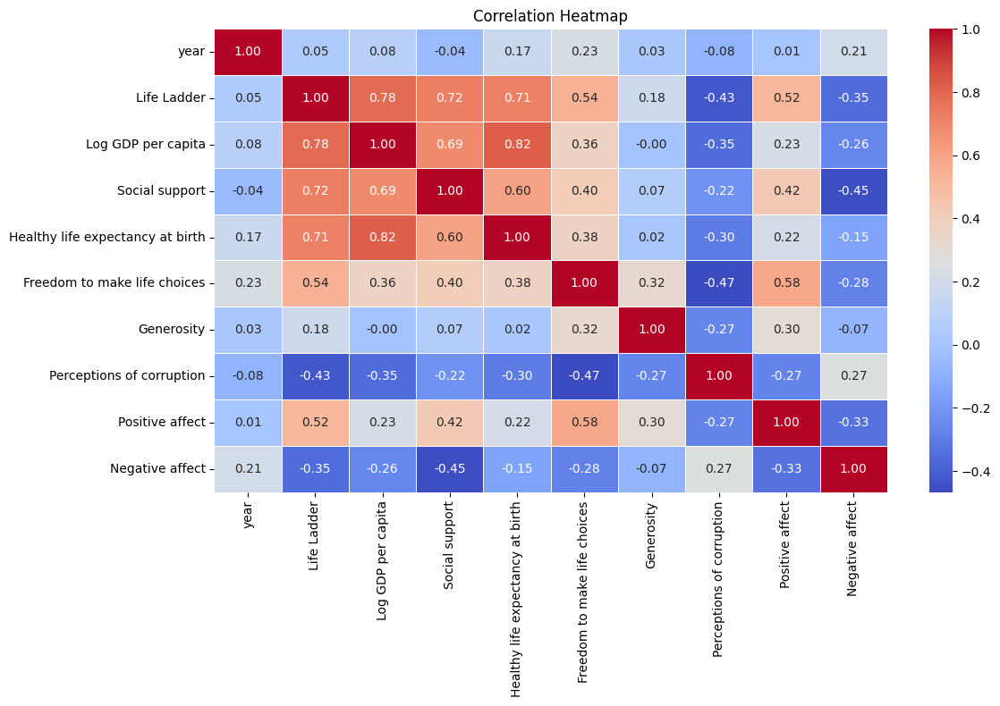
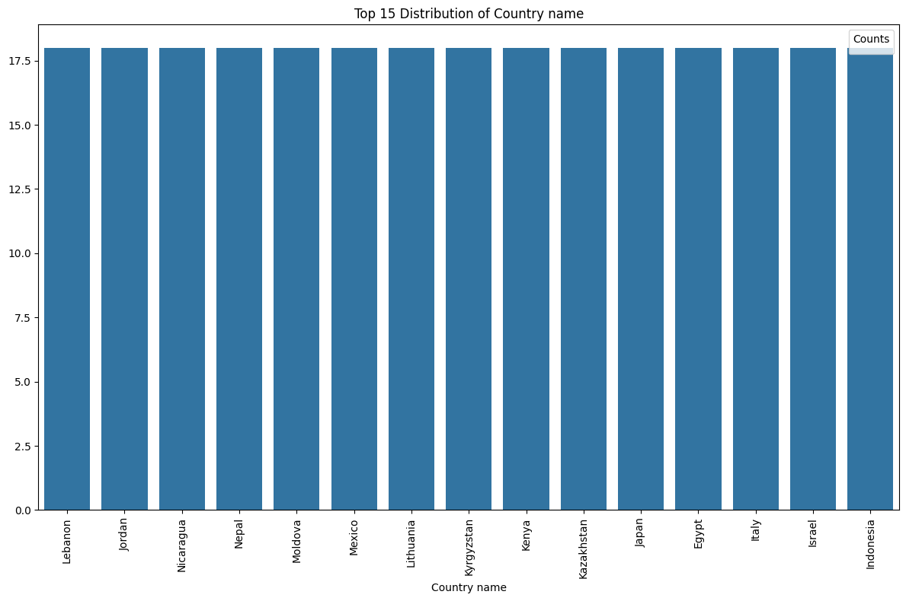
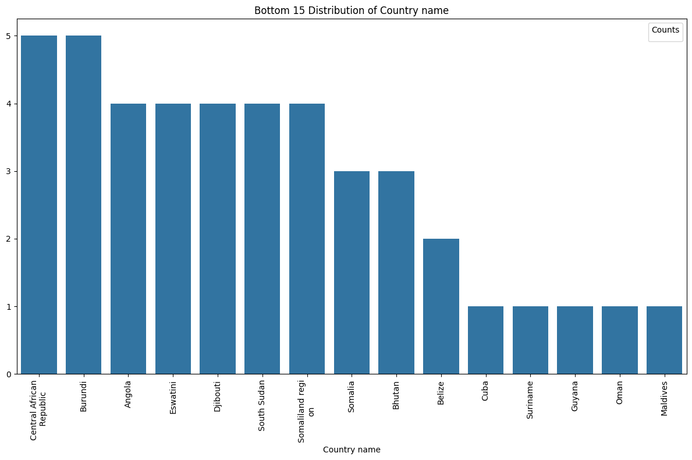
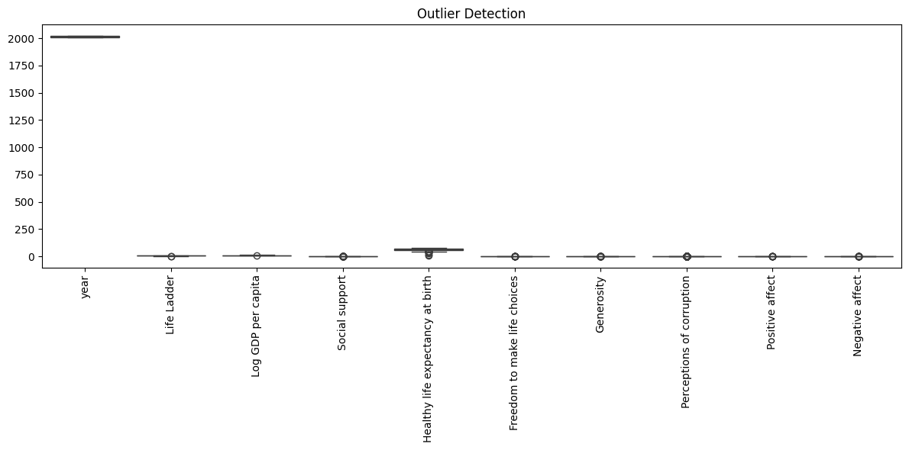

### *Every story is complicated until it finds the right storyteller — Anonymous*

# Happiness Data Analysis Story

## Introduction
In a world constantly evolving amid socio-economic changes, understanding what drives happiness is pivotal for the betterment of societies. Utilizing the **Happiness Dataset**, which encompasses data from **2363 respondents across 165 countries** over the years **2005 to 2023**, we aim to uncover patterns and insights on various factors affecting happiness and life satisfaction.

## Dataset Overview
The dataset, encapsulated in **happiness.csv**, includes 11 columns detailing key happiness-related metrics:

- **Country name**
- **Year**
- **Life Ladder**
- **Log GDP per capita**
- **Social support**
- **Healthy life expectancy at birth**
- **Freedom to make life choices**
- **Generosity**
- **Perceptions of corruption**
- **Positive affect**
- **Negative affect**

### Summary Statistics
Here are the summary statistics from the dataset:

| Statistic                              | Life Ladder | Log GDP per capita | Social support | Healthy life expectancy | Freedom to make choices | Generosity | Perceptions of corruption | Positive affect | Negative affect |
|----------------------------------------|-------------|---------------------|----------------|------------------------|------------------------|------------|--------------------------|-----------------|-----------------|
| **Count**                              | 2363        | 2335                | 2350           | 2300                   | 2327                   | 2282       | 2238                     | 2339            | 2347            |
| **Mean**                               | 5.48        | 9.40                | 0.81           | 63.40                  | 0.75                   | 0.00       | 0.74                     | 0.65            | 0.27            |
| **Standard Deviation**                 | 1.13        | 1.15                | 0.12           | 6.84                   | 0.14                   | 0.16       | 0.18                     | 0.11            | 0.09            |
| **Minimum**                            | 1.28        | 5.53                | 0.23           | 6.72                   | 0.23                   | -0.34      | 0.04                     | 0.18            | 0.08            |
| **Maximum**                            | 8.02        | 11.68               | 0.99           | 74.60                  | 0.99                   | 0.70       | 0.98                     | 0.88            | 0.70            |

## Key Insights from the Data

### Correlation Matrix

1. **Log GDP per Capita**: A strong positive correlation (0.78) with Life Ladder suggests that wealthier nations tend to have higher life satisfaction.
2. **Social Support**: A significant correlation with Life Ladder (0.72) highlights the importance of social networks.
3. **Perceptions of Corruption**: A negative correlation (-0.43) with Life Ladder indicates that higher corruption leads to lower life satisfaction.
4. **Healthy Life Expectancy**: More extended expectancies correlate positively with Life Ladder (0.71).

### Actionable Recommendations

- **Economic Growth Initiatives**: Promote policies to enhance GDP development, especially in nations with low Life Ladder scores.
- **Social Programs**: Invest in social capital and community support programs to enhance social support metrics.
- **Anti-Corruption Strategies**: Develop policies that aim to reduce corruption, thereby potentially increasing happiness scores.

## Geographic and Categorical Distribution

### Top and Bottom Countries - Life Ladder Distribution

This visualization demonstrates the top 15 countries with the highest Life Ladder scores, portraying a substantial disparity in well-being across different nations.

#### Bottom Distribution of Life Ladder

This chart highlights countries with the lowest scores in terms of well-being, necessitating focused interventions.

### Categorical Insights
To derive insights, categorical distributions were analyzed:
- **Frequency Distribution of Countries**: Identify which nations are contributing to overall happiness metrics.
- **Cross-Tabulatory Analysis**: Relationships and comparisons facilitate understanding broader trends.

## Outlier Detection

Utilizing the IQR method for outlier detection helps identify values that deviate significantly from others. Targeted investigations into these outliers can ensure accurate dataset representation.

### Actions on Outliers
- **Investigate Data Issues**: Confirm if outliers are due to data errors or genuine, extreme values.
- **Model Robustness**: Adapting model frameworks that are less sensitive to these outliers could enhance prediction capabilities.

## Conclusions
The happiness dataset provides profound insights into the interplay between economic, social, and health metrics as they relate to individual happiness. 

### Summary of Findings
- **Life Ladder Trends**: A global increase in overall life satisfaction but with considerable room for improvement in less satisfied countries.
- **Economic Indicators**: An essential driver of happiness and well-being; further growth can ameliorate life satisfaction levels.
- **Social Support**: A critical element that correlates directly with life satisfaction metrics.

### Future Directions
For policymakers and organizations, this data analysis provides a roadmap for interventions aimed at enhancing happiness. Targeting economic inequity, social support systems, and combating corruption will forge pathways to improved well-being for future generations. Further studies should focus on real-time data trends to assess ongoing impacts and responses to policy changes.

We invite you to explore the dataset and its insights further. For more information on gender studies, happiness indices, and socio-economic implications, check out [Happiness Studies](https://www.happinessstudiesacademy.com). 

Your journey towards understanding happiness has just begun!
