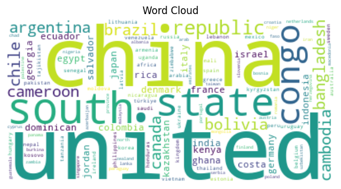
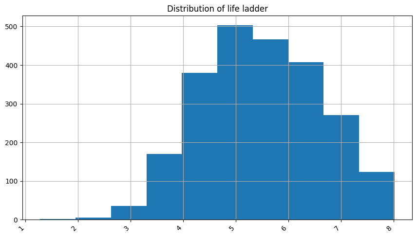

*Every story is complicated until it finds the right storyteller — Anonymous*

# Summary of findings

## Overview
File name: happiness.csv

The file has 2363 rows and 11 columns

### Sample 5 rows from file, for context

Sample data:
| country name   |
|:---------------|
| Madagascar     |
| Laos           |
| Vietnam        |
| Yemen          |
| Malawi         |

### Descriptive analysis of the data

|       |    year |   life ladder |   log gdp per capita |   social support |   healthy life expectancy at birth |   freedom to make life choices |   generosity |   perceptions of corruption |   positive affect |   negative affect |
|:------|--------:|--------------:|---------------------:|-----------------:|-----------------------------------:|-------------------------------:|-------------:|----------------------------:|------------------:|------------------:|
| count | 2363    |       2363    |              2335    |          2350    |                            2300    |                        2327    |      2282    |                     2238    |           2339    |           2347    |
| mean  | 2014.76 |          5.48 |                 9.4  |             0.81 |                              63.4  |                           0.75 |         0    |                        0.74 |              0.65 |              0.27 |
| std   |    5.06 |          1.13 |                 1.15 |             0.12 |                               6.84 |                           0.14 |         0.16 |                        0.18 |              0.11 |              0.09 |
| min   | 2005    |          1.28 |                 5.53 |             0.23 |                               6.72 |                           0.23 |        -0.34 |                        0.04 |              0.18 |              0.08 |
| 25%   | 2011    |          4.65 |                 8.51 |             0.74 |                              59.2  |                           0.66 |        -0.11 |                        0.69 |              0.57 |              0.21 |
| 50%   | 2015    |          5.45 |                 9.5  |             0.83 |                              65.1  |                           0.77 |        -0.02 |                        0.8  |              0.66 |              0.26 |
| 75%   | 2019    |          6.32 |                10.39 |             0.9  |                              68.55 |                           0.86 |         0.09 |                        0.87 |              0.74 |              0.33 |
| max   | 2023    |          8.02 |                11.68 |             0.99 |                              74.6  |                           0.98 |         0.7  |                        0.98 |              0.88 |              0.7  |

## Missing values report

|                                  |   Missing Values Count |   Missing Percentage (%) |
|:---------------------------------|-----------------------:|-------------------------:|
| country name                     |                      0 |                 0        |
| year                             |                      0 |                 0        |
| life ladder                      |                      0 |                 0        |
| log gdp per capita               |                     28 |                 1.18493  |
| social support                   |                     13 |                 0.550148 |
| healthy life expectancy at birth |                     63 |                 2.6661   |
| freedom to make life choices     |                     36 |                 1.52349  |
| generosity                       |                     81 |                 3.42785  |
| perceptions of corruption        |                    125 |                 5.28989  |
| positive affect                  |                     24 |                 1.01566  |
| negative affect                  |                     16 |                 0.677105 |

### Word Cloud Analysis

Some of these most frequently words are: united, china, south, state, congo, republic, argentina, bangladesh, bolivia, brazil, cambodia, cameroon, canada, chile, colombia, costa, rica, denmark, dominican, ecuador.

This heatmap visualizes the correlation between numerical features.

This boxplot highlights potential outliers for numerical features.

### Outlier Summary:

|                |   year |   life ladder |   log gdp per capita |   social support |   healthy life expectancy at birth |   freedom to make life choices |   generosity |   perceptions of corruption |   positive affect |   negative affect |
|:---------------|-------:|--------------:|---------------------:|-----------------:|-----------------------------------:|-------------------------------:|-------------:|----------------------------:|------------------:|------------------:|
| lower_bound    |   1999 |       2.13225 |               5.6775 |            0.504 |                            45.1588 |                         0.3595 |    -0.420625 |                    0.415875 |            0.3245 |            0.0335 |
| upper_bound    |   2031 |       8.83825 |              13.2215 |            1.144 |                            82.5887 |                         1.1635 |     0.402375 |                    1.13888  |            0.9845 |            0.5015 |
| outliers_count |      0 |       2       |               1      |           48     |                            20      |                        16      |    39        |                  194        |            9      |           31      |

### Time Series Analysis

This line plot shows trends over time for numerical data with a `Date` column.

<!--### Geographic Distribution
No geographic data found
-->

<!--### Network Analysis
No network analysis generated
-->

### Categorical Data Distribution
The following plots show the distribution of categorical data:

This bar chart shows the distribution of `country name` column.

Sample 5 rows from provided data, for context to Categorical distribution 
| country name   |
|:---------------|
| Sri Lanka      |
| Kenya          |
| Mexico         |
| Benin          |
| Costa Rica     |

### Numerical Data Histograms

This histogram plot represents the distribution of `year` column.

This histogram plot represents the distribution of `life ladder` column.

This histogram plot represents the distribution of `log gdp per capita` column.

This scatter plot represents the cluster analysis results.

Sample data with clusters:

| country name   |   year |   life ladder |   log gdp per capita |   social support |   healthy life expectancy at birth |   freedom to make life choices |   generosity | perceptions of corruption   |   positive affect |   negative affect |   Cluster |
|:---------------|-------:|--------------:|---------------------:|-----------------:|-----------------------------------:|-------------------------------:|-------------:|:----------------------------|------------------:|------------------:|----------:|
| Burundi        |   2011 |         3.706 |                6.694 |            0.422 |                             51.52  |                          0.49  |       -0.063 | 0.677                       |             0.572 |             0.19  |         2 |
| Zambia         |   2019 |         3.307 |                8.123 |            0.638 |                             54.4   |                          0.811 |        0.074 | 0.832                       |             0.674 |             0.394 |         2 |
| Botswana       |   2012 |         4.836 |                9.471 |            0.837 |                             51.48  |                          0.799 |       -0.197 | 0.814                       |             0.695 |             0.171 |         1 |
| Bahrain        |   2015 |         6.007 |               10.788 |            0.853 |                             66.2   |                          0.85  |        0.106 |                             |             0.653 |             0.303 |         1 |
| Poland         |   2016 |         6.162 |               10.258 |            0.917 |                             68.175 |                          0.871 |       -0.096 | 0.848                       |             0.666 |             0.224 |         1 |

<!--### pca analysis
Error during pca analysis
-->

