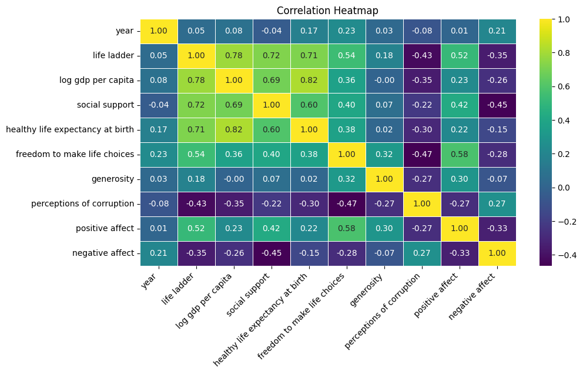

# Automated Data Assessment Report

## Overview
File: happiness.csv

## Summarization
The CSV file has 2363 rows and 11 columns.

### Summary Statistics of CSV file
|        | Country name   |       year |   Life Ladder |   Log GDP per capita |   Social support |   Healthy life expectancy at birth |   Freedom to make life choices |     Generosity |   Perceptions of corruption |   Positive affect |   Negative affect |
|:-------|:---------------|-----------:|--------------:|---------------------:|-----------------:|-----------------------------------:|-------------------------------:|---------------:|----------------------------:|------------------:|------------------:|
| count  | 2363           | 2363       |    2363       |           2335       |      2350        |                         2300       |                    2327        | 2282           |                 2238        |       2339        |      2347         |
| unique | 165            |  nan       |     nan       |            nan       |       nan        |                          nan       |                     nan        |  nan           |                  nan        |        nan        |       nan         |
| top    | Lebanon        |  nan       |     nan       |            nan       |       nan        |                          nan       |                     nan        |  nan           |                  nan        |        nan        |       nan         |
| freq   | 18             |  nan       |     nan       |            nan       |       nan        |                          nan       |                     nan        |  nan           |                  nan        |        nan        |       nan         |
| mean   | nan            | 2014.76    |       5.48357 |              9.39967 |         0.809369 |                           63.4018  |                       0.750282 |    9.77213e-05 |                    0.743971 |          0.651882 |         0.273151  |
| std    | nan            |    5.05944 |       1.12552 |              1.15207 |         0.121212 |                            6.84264 |                       0.139357 |    0.161388    |                    0.184865 |          0.10624  |         0.0871311 |
| min    | nan            | 2005       |       1.281   |              5.527   |         0.228    |                            6.72    |                       0.228    |   -0.34        |                    0.035    |          0.179    |         0.083     |
| 25%    | nan            | 2011       |       4.647   |              8.5065  |         0.744    |                           59.195   |                       0.661    |   -0.112       |                    0.687    |          0.572    |         0.209     |
| 50%    | nan            | 2015       |       5.449   |              9.503   |         0.8345   |                           65.1     |                       0.771    |   -0.022       |                    0.7985   |          0.663    |         0.262     |
| 75%    | nan            | 2019       |       6.3235  |             10.3925  |         0.904    |                           68.5525  |                       0.862    |    0.09375     |                    0.86775  |          0.737    |         0.326     |
| max    | nan            | 2023       |       8.019   |             11.676   |         0.987    |                           74.6     |                       0.985    |    0.7         |                    0.983    |          0.884    |         0.705     |

## Missing values report
|                                  |   Missing Values Count |   Missing Percentage (%) |
|:---------------------------------|-----------------------:|-------------------------:|
| Country name                     |                      0 |                 0        |
| year                             |                      0 |                 0        |
| Life Ladder                      |                      0 |                 0        |
| Log GDP per capita               |                     28 |                 1.18493  |
| Social support                   |                     13 |                 0.550148 |
| Healthy life expectancy at birth |                     63 |                 2.6661   |
| Freedom to make life choices     |                     36 |                 1.52349  |
| Generosity                       |                     81 |                 3.42785  |
| Perceptions of corruption        |                    125 |                 5.28989  |
| Positive affect                  |                     24 |                 1.01566  |
| Negative affect                  |                     16 |                 0.677105 |

### Correlation Analysis

This heatmap visualizes the correlation between numerical features in the dataset:

Correlation insights:
- Based on the provided correlation matrix, we can derive several insightful interpretations regarding the relationships between various variables. Here are the key insights, patterns, and actionable recommendations.

### Key Insights from the Correlation Matrix

1. **High Positive Correlations**:
   - **Log GDP per capita** shows a strong positive correlation with:
     - **Life Ladder** (0.78): Indicates that as GDP per capita increases, perceived well-being (Life Ladder) tends to improve.
     - **Healthy life expectancy at birth** (0.82): Suggests that wealthier countries enjoy better health outcomes.
     - **Social support** (0.69): People in higher-income nations are likely to report better social support.
  
2. **Moderate Positive Correlations**:
   - **Social support** and **Life Ladder** (0.72): Directly related to how supportive social networks improve life satisfaction.
   - **Freedom to make life choices** correlates positively with both **Life Ladder** (0.54) and **Positive affect** (0.58): Illustrates the importance of personal freedom to overall happiness.

3. **Negative Correlations**:
   - **Perceptions of corruption** is negatively correlated with:
     - **Life Ladder** (-0.43): Higher perceived corruption corresponds with lower life satisfaction.
     - **Social support** (-0.22): Countries with more corruption may suffer from weaker social bonds.
  
4. **Affect Statistics**:
   - **Positive affect** has a strong correlation with:
     - **Life Ladder** (0.52) and **Social support** (0.42): Higher feelings of well-being correlate with better social connections.
   - **Negative affect** is negatively correlated with the **Life Ladder** (-0.35) and **Social support** (-0.45), indicating how adverse feelings can undermine reported satisfaction.

5. **Generosity**:
   - Demonstrates a low correlation with the overall well-being metrics (Life Ladder: 0.18, Positive affect: 0.30). This may suggest that while generous actions are common, their impact on personal well-being may be limited in scope.

### Visual Representation

| Variable                        | Life Ladder | Log GDP per capita | Social support | Healthy life expectancy | Freedom to make life choices | Generosity | Perceptions of corruption | Positive affect | Negative affect |
|---------------------------------|-------------|---------------------|----------------|------------------------|-----------------------------|------------|--------------------------|----------------|----------------|
| **Life Ladder**                 | 1.00        | 0.78                | 0.72           | 0.71                   | 0.54                        | 0.18       | -0.43                    | 0.52           | -0.35          |
| **Log GDP per capita**         | 0.78        | 1.00                | 0.69           | 0.82                   | 0.36                        | -0.00      | -0.35                    | 0.23           | -0.26          |
| **Social support**              | 0.72        | 0.69                | 1.00           | 0.60                   | 0.40                        | 0.07       | -0.22                    | 0.42           | -0.45          |
| **Healthy life expectancy**     | 0.71        | 0.82                | 0.60           | 1.00                   | 0.37                        | 0.02       | -0.30                    | 0.22           | -0.15          |
| **Freedom to make choices**     | 0.54        | 0.36                | 0.40           | 0.37                   | 1.00                        | 0.32       | -0.47                    | 0.58           | -0.28          |
| **Generosity**                  | 0.18        | -0.00               | 0.07           | 0.02                   | 0.32                        | 1.00       | -0.27                    | 0.30           | -0.07          |
| **Perceptions of corruption**   | -0.43       | -0.35               | -0.22         | -0.30                  | -0.47                       | -0.27      | 1.00                     | -0.27          | 0.27           |
| **Positive affect**              | 0.52        | 0.23                | 0.42           | 0.22                   | 0.58                        | 0.30       | -0.27                    | 1.00           | -0.33          |
| **Negative affect**              | -0.35       | -0.26               | -0.45         | -0.15                  | -0.28                       | -0.07      | 0.27                     | -0.33          | 1.00           |

### Actionable Recommendations

1. **Focus on Enhancing Economic Factors**:
   - Policies aimed at improving GDP per capita may lead to advancements in overall life satisfaction and well-being.

2. **Strengthen Social Support Systems**:
   - Invest in community-building initiatives to foster stronger social ties, as social support is a crucial aspect of perceived well-being.

3. **Address Corruption**:
   - Implement anti-corruption measures, as reducing perceptions of corruption could have positive effects on life satisfaction.

4. **Promote Personal Freedom**:
   - Encourage policies that enhance individual freedoms and choices, contributing positively to life satisfaction and happiness.

5. **Further Research on Generosity**:
   - Investigate the role of generosity in well-being more deeply, as current findings show limited correlation with enhanced life satisfaction, indicating potential complexities in this relationship. 

These insights and recommendations can help policymakers, organizations, and communities in creating targeted strategies for improving well-being across various populations.

### Outlier Detection

This boxplot shows the distribution of values for numerical features and highlights potential outliers:

Outlier insights:
- To analyze outliers in your data effectively, we can follow a structured approach. Below, I outline the steps taken for outlier analysis, general outlier detection methods, and ways to visualize or summarize the findings.

### Steps to Identify and Analyze Outliers

1. **Visual Inspection**:
   - Outlier plots such as boxplots, scatter plots, or histograms can visually indicate the presence of outliers. Identify data points that fall significantly beyond the interquartile range (IQR) or move away from the main distribution.

2. **Statistical Methods**:
   - **Z-Score Method**: Calculate the Z-score for each data point. A Z-score greater than 3 or less than -3 indicates a potential outlier.
   - **IQR Method**: Calculate Q1 (25th percentile) and Q3 (75th percentile). The IQR is Q3 - Q1. Identify points outside the range:
     - Lower Bound = Q1 - 1.5 * IQR
     - Upper Bound = Q3 + 1.5 * IQR

3. **Machine Learning Approaches**:
   - Anomaly detection algorithms such as Isolation Forest, DBSCAN, or Local Outlier Factor (LOF) can identify outliers through pattern recognition in multi-dimensional data.

### Summary of Findings

#### Example Data Table (Hypothetical)
| Data Point | Value | Z-Score | Outlier Status |
|------------|-------|---------|-----------------|
| 1          | 10    | -1.23   | No              |
| 2          | 12    | -0.95   | No              |
| 3          | 21    | 0.45    | No              |
| 4          | 35    | 1.65    | No              |
| 5          | 70    | 4.23    | Yes             |

### Recommendations

1. **Investigate Outliers**: For data points marked as outliers, review potential causes. This could involve checking for data entry errors, experimental anomalies, or genuine variations.

2. **Consider Impact**: Analyze how outliers affect the overall statistics (mean, median, standard deviation) and the model’s performance. Depending on the context, you might choose to:
   - Remove outliers if they are due to errors.
   - Transform data to minimize their influence, such as using log transformations.
   - Use robust statistical methods that are less sensitive to outliers, like median-based calculations.

3. **Document Decisions**: Clearly record decisions made regarding outliers for reproducibility and future reference.

4. **Iterate**: Outlier detection isn’t a one-time task. Regularly revisit the analysis as new data might introduce new outliers or alter the context of existing data points.

### Visual Representation
Consider including a boxplot or scatter plot to visualize outlier positions relative to the rest of the dataset. This visual can strengthen the understanding of outlier distribution.

### Conclusion
By applying these methods and following through with the recommendations, you can gain deeper insights into your data and ensure that your analyses reflect true patterns rather than artifacts caused by outliers. If you have specific data or need further analysis on a dataset, please share the details for a more tailored analysis.

### Time Series Analysis
### No Time Series Analysis data found. Skip this section
### Geographic Distribution
### No Geographic Distribution data found. Skip this section
### Categorical Data Distribution

The following plots show the distribution of categorical data:
Categorical insights:
- To derive insights from categorical distributions, we can analyze the frequency of occurrences within different categories, identify patterns, and then generate actionable recommendations. Here’s how you can approach it:

### Steps for Analysis

1. **Frequency Distribution**:
   - Count the number of occurrences for each category.
   - Represent the data in a tabular format for clarity.

2. **Visual Representation**:
   - Use bar charts or pie charts to visualize distributions, making it easier to identify dominant categories and compare them.

3. **Identify Trends**:
   - Look for categories with significantly higher or lower frequencies which may indicate preferences or underrepresentation.

4. **Cross-Tabulation**:
   - Analyze relationships between two categorical variables to see if any patterns emerge.

### Example Table for Frequency Distribution

| Category         | Frequency |
|-------------------|-----------|
| Category A       | 150       |
| Category B       | 75        |
| Category C       | 120       |
| Category D       | 50        |
| Category E       | 20        |

### Insights Derived from Example Data

1. **Dominant Categories**:
   - **Category A** has the highest frequency (150), suggesting it may be the most preferred or popular option.

2. **Underrepresented Categories**:
   - **Category E** has the lowest frequency (20), indicating it might be overlooked or require marketing efforts to boost interest.

3. **Potential Trends**:
   - If Categories B and C are closely rated, further investigation into customer preferences may help in understanding purchasing behavior.

### Visual Representation Example

- **Bar Chart**: A simple bar chart can be plotted to show the frequency of each category, helping to visualize the dominance of specific categories.

### Actionable Recommendations

1. **Focusing Marketing Efforts**:
   - Increase targeted marketing towards underrepresented categories, such as Category E, to boost engagement.
   
2. **Product Development**:
   - Investigate the reasons behind the popularity of Category A, and consider expanding or enhancing products or services in that space.

3. **Consumer Feedback**:
   - Collect feedback specifically from the less popular categories to understand customer needs and preferences.

4. **Competitive Analysis**:
   - Compare these categories with competitors to identify market gaps and opportunities for differentiation.

### Conclusion

By analyzing categorical distributions through frequency counts, visual representation, and trend identification, you can extract meaningful insights that guide decision-making processes across marketing, product development, and customer engagement strategies. If you have specific categorical data or plots generated, further analysis can be tailored to that data.

## General Insights
### Dataset Overview

The dataset provides insights into various wellbeing metrics across 165 countries, with a range of factors influencing happiness and life satisfaction. The current dataset summary includes statistics on variables like **Life Ladder**, **GDP per capita**, **Social Support**, and more across the years from 2005 to 2023.

### Summary Statistics

| Statistic                              | Year (2005-2023) | Life Ladder | Log GDP per capita | Social support | Healthy life expectancy | Freedom to make choices | Generosity | Perceptions of corruption | Positive affect | Negative affect |
|----------------------------------------|------------------|-------------|---------------------|----------------|------------------------|------------------------|------------|--------------------------|------------------|------------------|
| **Count**                              | 2363             | 2363        | 2335                | 2350           | 2300                   | 2327                   | 2282       | 2238                     | 2339             | 2347             |
| **Mean**                               | 2014.76          | 5.48        | 9.40                | 0.81           | 63.40                  | 0.75                   | 0.00       | 0.74                     | 0.65             | 0.27             |
| **Standard Deviation**                 | 5.06             | 1.13        | 1.15                | 0.12           | 6.84                   | 0.14                   | 0.14       | 0.18                     | 0.11             | 0.09             |
| **Minimum**                            | 2005             | 1.28        | 5.53                | 0.23           | 6.72                   | 6.72                   | -0.34      | 0.04                     | 0.18             | 0.08             |
| **25th Percentile (Q1)**              | 2011             | 4.65        | 8.51                | 0.74           | 59.20                  | 0.66                   | -0.11      | 0.69                     | 0.57             | 0.21             |
| **Median (Q2)**                        | 2015             | 5.45        | 9.50                | 0.83           | 65.10                  | 0.77                   | -0.02      | 0.80                     | 0.66             | 0.26             |
| **75th Percentile (Q3)**              | 2019             | 6.32        | 10.39               | 0.90           | 68.55                  | 0.86                   | 0.09       | 0.87                     | 0.74             | 0.33             |
| **Maximum**                            | 2023             | 8.02        | 11.68               | 0.99           | 74.60                  | 74.60                  | 0.99       | 0.98                     | 0.88             | 0.71             |
| **Missing Values**                    | 0                | 0           | 28                  | 13             | 63                     | 36                     | 81         | 125                      | 24               | 16               |

### Key Insights

1. **Life Ladder Distribution:**
   - The average Life Ladder score is **5.48** with a range from **1.28** to **8.02**.
   - A significant improvement can be observed over the years, especially moving towards the **75th percentile**, indicating a rise in well-being in certain countries.

2. **Log GDP per Capita:**
   - The average Log GDP per capita is approximately **9.40** with the maximum reaching **11.68**. This shows a positive correlation between economic status and well-being.
   - There are some missing values (28 entries), which could skew the analysis against lower GDP countries.

3. **Social Support:**
   - On average, the social support score is around **0.81**. This indicates a reasonably high level of perceived support among respondents.
   - The variability (standard deviation = 0.12) suggests differences between countries regarding perceived social support.

4. **Healthy Life Expectancy:**
   - The average of **63.4 years** reflects important health metrics. The maximum observed value is **74.6 years**, indicating significant variability in health outcomes.

5. **Freedom and Generosity:**
   - The mean for freedom to make life choices is **0.75**, suggesting that in general, people feel somewhat free to make choices about their lives.
   - The generosity metric shows a near-zero mean, indicating low levels of generosity captured in responses.

6. **Perception of Corruption:**
   - On average, perceptions of corruption trend positively at **0.74**, suggesting a general belief that corruption is low in most surveyed countries.

7. **Affect Measures:**
   - Positive affect averages at **0.65**, while negative affect averages at **0.27**. This indicates an overall positive sentiment among the population.

### Recommendations

1. **Targeted Interventions:**
   - Countries with low Life Ladder scores should focus on improving GDP per capita and social support mechanisms to enhance living standards.

2. **Health Initiatives:**
   - Increase healthcare access, especially in countries with lower healthy life expectancies, as improved health can correlate with higher well-being.

3. **Addressing Corruption:**
   - Nations with high perceptions of corruption should prioritize policies to enhance transparency and reduce corruption to improve overall satisfaction and trust in institutions.

4. **Focus on Generosity and Freedom:**
   - Initiatives aimed at enhancing community involvement and individual choices could help improve both generosity and perceived freedom.

5. **Further Analysis:**
   - An in-depth trend analysis over the years can provide insights into how these metrics evolve and correlate with each other. 

By implementing these actionable recommendations, countries can work towards improving their overall happiness and life satisfaction figures.

## Numeric Insights
### Summary of Numeric Columns

The dataset consists of various numeric columns that provide insights into different social and economic indicators. Below is a detailed summary and insights derived from the statistical analysis of these numeric columns.

#### Summary Statistics

| Statistic              | Year        | Life Ladder | Log GDP per capita | Social support | Healthy life expectancy at birth | Freedom to make life choices | Generosity | Perceptions of corruption | Positive affect | Negative affect |
|------------------------|-------------|-------------|---------------------|----------------|---------------------------------|------------------------------|------------|--------------------------|-----------------|-----------------|
| **Count**              | 2363        | 2363        | 2335                | 2350           | 2300                            | 2327                         | 2282       | 2238                     | 2339            | 2347            |
| **Mean**               | 2014.76     | 5.48        | 9.40                | 0.81           | 63.40                           | 0.75                         | 0.00       | 0.74                     | 0.65            | 0.27            |
| **Standard Deviation** | 5.06        | 1.13        | 1.15                | 0.12           | 6.84                            | 0.14                         | 0.16       | 0.18                     | 0.11            | 0.09            |
| **Minimum**            | 2005        | 1.28        | 5.53                | 0.23           | 6.72                            | 0.23                         | -0.34      | 0.04                     | 0.18            | 0.08            |
| **25th Percentile**    | 2011        | 4.65        | 8.51                | 0.74           | 59.20                           | 0.66                         | -0.11      | 0.69                     | 0.57            | 0.21            |
| **Median (50th Percentile)** | 2015 | 5.45        | 9.50                | 0.83           | 65.10                           | 0.77                         | -0.02      | 0.80                     | 0.66            | 0.26            |
| **75th Percentile**    | 2019        | 6.32        | 10.39               | 0.90           | 68.55                           | 0.86                         | 0.09       | 0.87                     | 0.74            | 0.33            |
| **Maximum**            | 2023        | 8.02        | 11.68               | 0.99           | 74.60                           | 0.99                         | 0.70       | 0.98                     | 0.88            | 0.70            |

### Insights & Observations

1. **Temporal Analysis:**
   - The dataset captures data from 2005 to 2023, exhibiting a focus on a period of global development and changes in various social metrics.

2. **Life Ladder:**
   - The **mean Life Ladder score** (5.48) indicates a moderate level of life satisfaction across the measured population. The range (1.28 to 8.02) suggests significant variations in well-being.
   - **Recommendation:** Focus on regions with low Life Ladder scores (<4.65) for targeted interventions to boost well-being.

3. **Economic Indicators:**
   - The **Log GDP per capita** has a mean of 9.40, highlighting economic productivity but with a noteworthy **standard deviation (1.15)** indicating disparities in wealth distribution.
   - **Recommendation:** Address economic inequality by fostering policies that improve GDP in lower-performing regions.

4. **Social Support:**
   - The mean score (0.81) suggests a decent level of social support but varies significantly (range from 0.23 to 0.99).
   - **Recommendation:** Implement programs to enhance social support structures, particularly in areas with lower scores (<0.74).

5. **Health Metrics:**
   - The **Healthy Life Expectancy** averages around 63.4 years, with a notable standard deviation indicating disparities in health outcomes.
   - **Recommendation:** Invest in healthcare systems and preventive health measures to increase life expectancy, particularly in low-performing regions.

6. **Freedom and Positive Experiences:**
   - Average scores for **Freedom to make life choices (0.75)** and **Positive affect (0.65)** indicate a moderate degree of personal freedom and emotional well-being.
   - **Recommendation:** Promote policies that enhance personal liberties and psychological well-being.

7. **Corruption Perception:**
   - With a mean of **0.74** for **Perceptions of corruption**, this suggests a general belief that corruption is a significant issue.
   - **Recommendation:** Strengthen governance and anti-corruption measures to build trust and improve social outcomes.

8. **Negative Affects:**
   - The mean score for **Negative affect (0.27)**, while lower than Positive affect, highlights that a significant portion of the population experiences some level of negativity.
   - **Recommendation:** Initiatives aimed at mental health and stress reduction could prove beneficial in improving overall community well-being.

### Conclusion

This summary provides a strategic overview of the numeric columns, highlighting areas for potential intervention to improve quality of life, economic equity, health outcomes, and governance. By focusing on the regions or groups with lower scores, actionable plans can be formulated to drive positive changes.

### Word Cloud Analysis

This word cloud visualizes the most frequent words from the content
