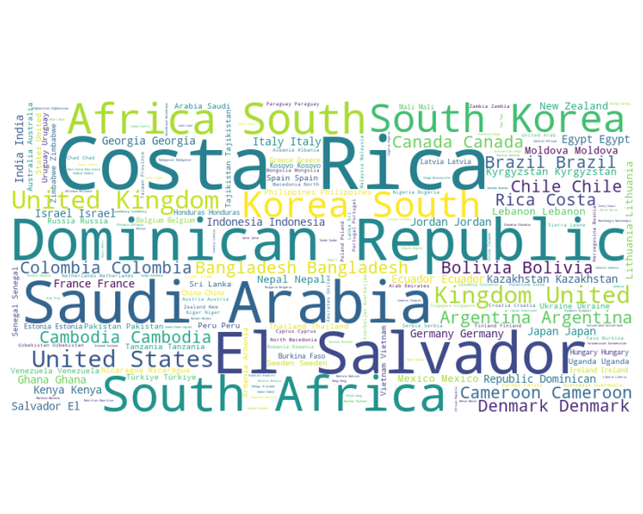

# Data Analysis Report for file python/tdsproject2/happiness/happiness.csv

## Data Quality Report
**Total Rows:**
- 2363
**Total Columns:**
- 11
**Missing Values:**
- Country name: 0
- year: 0
- Life Ladder: 0
- Log GDP per capita: 28
- Social support: 13
- Healthy life expectancy at birth: 63
- Freedom to make life choices: 36
- Generosity: 81
- Perceptions of corruption: 125
- Positive affect: 24
- Negative affect: 16
**Data Types:**
- Country name: object
- year: int64
- Life Ladder: float64
- Log GDP per capita: float64
- Social support: float64
- Healthy life expectancy at birth: float64
- Freedom to make life choices: float64
- Generosity: float64
- Perceptions of corruption: float64
- Positive affect: float64
- Negative affect: float64
**Unique Values:**
- Country name: 165
- year: 19
- Life Ladder: 1814
- Log GDP per capita: 1760
- Social support: 484
- Healthy life expectancy at birth: 1126
- Freedom to make life choices: 550
- Generosity: 650
- Perceptions of corruption: 613
- Positive affect: 442
- Negative affect: 394

## Statistical Analysis
### Descriptive Statistics
| Column | Count | Mean | Std | Min | 25% | 50% | 75% | Max |
|--------|-------|------|-----|-----|-----|-----|-----|-----|
| year | 2363.0 | 2014.7638595006347 | 5.059436468192795 | 2005.0 | 2011.0 | 2015.0 | 2019.0 | 2023.0 |
| Life Ladder | 2363.0 | 5.483565806178587 | 1.1255215132391925 | 1.281 | 4.647 | 5.449 | 6.3235 | 8.019 |
| Log GDP per capita | 2335.0 | 9.399671092077089 | 1.1520694444710216 | 5.527 | 8.506499999999999 | 9.503 | 10.3925 | 11.676 |
| Social support | 2350.0 | 0.8093693617021277 | 0.12121176420299144 | 0.228 | 0.744 | 0.8345 | 0.904 | 0.987 |
| Healthy life expectancy at birth | 2300.0 | 63.40182826086957 | 6.842644351828009 | 6.72 | 59.195 | 65.1 | 68.5525 | 74.6 |
| Freedom to make life choices | 2327.0 | 0.750281908036098 | 0.13935703459253465 | 0.228 | 0.661 | 0.771 | 0.862 | 0.985 |
| Generosity | 2282.0 | 9.772129710780206e-05 | 0.16138760312630687 | -0.34 | -0.112 | -0.022 | 0.09375 | 0.7 |
| Perceptions of corruption | 2238.0 | 0.7439709562109026 | 0.1848654805936834 | 0.035 | 0.687 | 0.7985 | 0.86775 | 0.983 |
| Positive affect | 2339.0 | 0.6518820008550662 | 0.10623970474397627 | 0.179 | 0.572 | 0.663 | 0.737 | 0.884 |
| Negative affect | 2347.0 | 0.27315083084789094 | 0.08713107245795021 | 0.083 | 0.209 | 0.262 | 0.326 | 0.705 |
### Skewness
- year: -0.06432818603748826
- Life Ladder: -0.053777314417818245
- Log GDP per capita: nan
- Social support: nan
- Healthy life expectancy at birth: nan
- Freedom to make life choices: nan
- Generosity: nan
- Perceptions of corruption: nan
- Positive affect: nan
- Negative affect: nan
### Kurtosis
- year: -1.0893364395025305
- Life Ladder: -0.5636193837867576
- Log GDP per capita: nan
- Social support: nan
- Healthy life expectancy at birth: nan
- Freedom to make life choices: nan
- Generosity: nan
- Perceptions of corruption: nan
- Positive affect: nan
- Negative affect: nan
## Visualizations

## Dimensionality Reduction
Reduced Data Shape: (2363, 2)

## KMeans Clustering
Clustered Data:
  Country name    year  Life Ladder  ...  Positive affect  Negative affect  Cluster
0  Afghanistan  2008.0        3.724  ...            0.414            0.258       -1
1  Afghanistan  2009.0        4.402  ...            0.481            0.237       -1
2  Afghanistan  2010.0        4.758  ...            0.517            0.275       -1
3  Afghanistan  2011.0        3.832  ...            0.480            0.267       -1
4  Afghanistan  2012.0        3.783  ...            0.614            0.268       -1

[5 rows x 12 columns]

 denote outliers (DBSCAN). The visualization highlights the relationships between clusters after dimensionality reduction.')

## Content Summary
### Summary of the Dataset

The provided dataset appears to focus on various socio-economic and psychological factors across different countries and years, with a significant emphasis on measurements of well-being and quality of life. It includes a subset of data for three countries: Afghanistan, Albania, and Algeria, all recorded in the year 1970.

### Overall Dataset Composition

- **Number of Records**: The dataset contains at least 33 records based on the snippet.
- **Countries Represented**: Afghanistan (15 entries), Albania (13 entries), and Algeria (5 entries).
- **Year**: All records are for the year 1970, indicating a snapshot study of that period.
  
### Key Variables and Their Significance

1. **Life Ladder**: Represents subjective well-being, indicating how individuals feel about their current life situation. A higher score suggests higher levels of general happiness and life satisfaction.
  
2. **Log GDP per capita**: Measures economic wealth, and is logged to stabilize variance and interpretability.
  
3. **Social support**: Pertains to the perceived availability of support from family, friends, and the community, crucial for mental well-being.
  
4. **Healthy life expectancy at birth**: Reflects the expected number of years of life lived in good health. This is an important health indicator.
  
5. **Freedom to make life choices**: Indicates how much personal autonomy individuals feel they possess.
  
6. **Generosity**: Measures charitable behavior and how much individuals are willing to help others, affecting social cohesion and well-being.
  
7. **Perceptions of corruption**: Reflects public sentiment regarding the integrity of societal institutions, affecting trust and happiness.
  
8. **Positive/Negative affect**: Psychological measures indicating the balance of positive versus negative feelings experienced by individuals.

### Notable Patterns or Trends

- **Variability in Life Ladder Scores**: Afghanistan shows a wider range of Life Ladder scores (from 1.281 to 4.758), suggesting significant differences in subjective well-being perception among its sub-samples, likely influenced by socio-political factors. In contrast, Albania's scores range from 4.511 to 5.867, indicating a relatively stable and higher perception of life quality at that time.
  
- **Economic Indicators**: Both Afghanistan and Algeria display lower Log GDP per capita values compared to Albania, suggesting a correlation where higher economic status (indicated by a higher Log GDP) aligns with better perceived quality of life.

- **Social Support and Healthy Life Expectancy**: The values of social support across these countries vary, revealing a probable relationship between social connections and life satisfaction. For instance, higher social support correlates with better healthy life expectancy metrics.

- **Corruption Perception**: Data for perceptions of corruption is not detailed, but it's important to note that at lower corruption levels, higher happiness is often observed due to enhanced trust in institutions.

### Potential Insights or Implications

1. **Interconnectedness of Variables**: The analysis suggests that economic prosperity (Log GDP) is closely linked to well-being (Life Ladder) and social factors (social support), indicating that policies aimed at improving one area, such as economic development, might yield benefits in terms of social and psychological outcomes as well.

2. **Cultural and Political Context**: Afghanistan's lower scores in multiple dimensions may reflect ongoing issues such as conflict and instability, which might hinder social connectivity and perception of freedom. As such, interventions could focus on stability and governance.

3. **Importance of Social Capital**: The significance of social support in well-being highlights the necessity for policies that foster community engagement and social networks, especially in lower-income or conflict-affected settings.

4. **Baseline for Future Comparison**: The dataset serves as a historical baseline for evaluating changes over time in life satisfaction and related indicators, especially as countries develop or undergo transitions.

In summary, this dataset highlights critical socio-economic factors impacting individual well-being across different countries and sets a foundation for understanding the multidimensional nature of quality of life. The variations in these indicators across countries indicate a complex interplay of economic, social, and psychological factors that can inform policy decisions aimed at enhancing overall human welfare.
