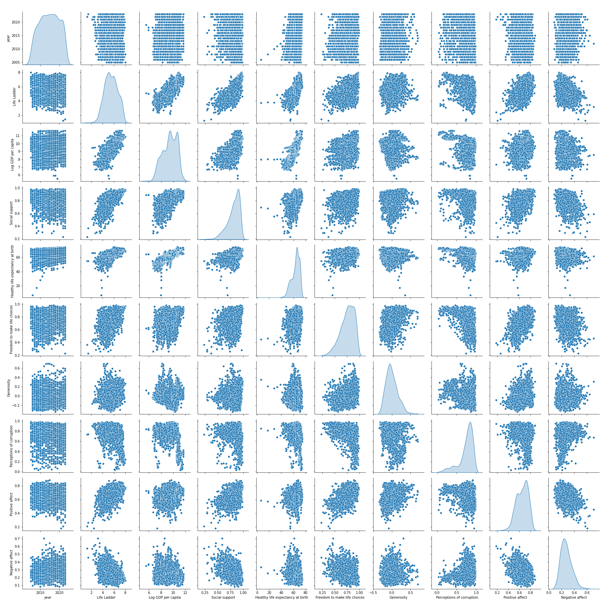
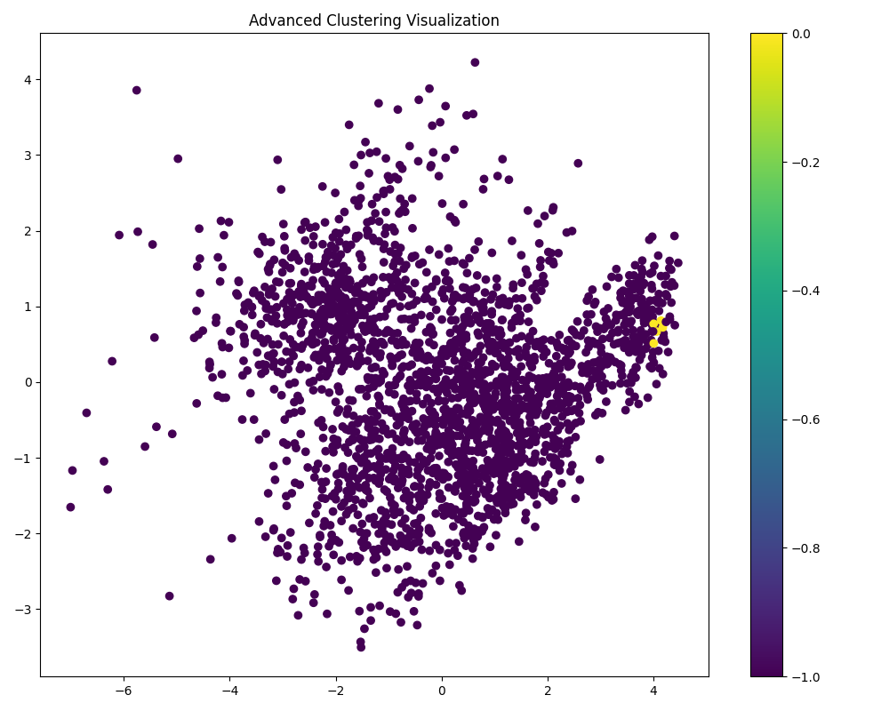

# Data Analysis Report for file python/tdsproject2/happiness/happiness.csv

## Data Quality Report
**Total Rows:**
- 2363
**Total Columns:**
- 11
**Missing Values:**
- Country name: 0
- year: 0
- Life Ladder: 0
- Log GDP per capita: 28
- Social support: 13
- Healthy life expectancy at birth: 63
- Freedom to make life choices: 36
- Generosity: 81
- Perceptions of corruption: 125
- Positive affect: 24
- Negative affect: 16
**Data Types:**
- Country name: object
- year: int64
- Life Ladder: float64
- Log GDP per capita: float64
- Social support: float64
- Healthy life expectancy at birth: float64
- Freedom to make life choices: float64
- Generosity: float64
- Perceptions of corruption: float64
- Positive affect: float64
- Negative affect: float64
**Unique Values:**
- Country name: 165
- year: 19
- Life Ladder: 1814
- Log GDP per capita: 1760
- Social support: 484
- Healthy life expectancy at birth: 1126
- Freedom to make life choices: 550
- Generosity: 650
- Perceptions of corruption: 613
- Positive affect: 442
- Negative affect: 394

## Statistical Analysis
### Descriptive Statistics
| Column | Count | Mean | Std | Min | 25% | 50% | 75% | Max |
|--------|-------|------|-----|-----|-----|-----|-----|-----|
| year | 2363.0 | 2014.7638595006347 | 5.059436468192795 | 2005.0 | 2011.0 | 2015.0 | 2019.0 | 2023.0 |
| Life Ladder | 2363.0 | 5.483565806178587 | 1.1255215132391925 | 1.281 | 4.647 | 5.449 | 6.3235 | 8.019 |
| Log GDP per capita | 2335.0 | 9.399671092077089 | 1.1520694444710216 | 5.527 | 8.506499999999999 | 9.503 | 10.3925 | 11.676 |
| Social support | 2350.0 | 0.8093693617021277 | 0.12121176420299144 | 0.228 | 0.744 | 0.8345 | 0.904 | 0.987 |
| Healthy life expectancy at birth | 2300.0 | 63.40182826086957 | 6.842644351828009 | 6.72 | 59.195 | 65.1 | 68.5525 | 74.6 |
| Freedom to make life choices | 2327.0 | 0.750281908036098 | 0.13935703459253465 | 0.228 | 0.661 | 0.771 | 0.862 | 0.985 |
| Generosity | 2282.0 | 9.772129710780206e-05 | 0.16138760312630687 | -0.34 | -0.112 | -0.022 | 0.09375 | 0.7 |
| Perceptions of corruption | 2238.0 | 0.7439709562109026 | 0.1848654805936834 | 0.035 | 0.687 | 0.7985 | 0.86775 | 0.983 |
| Positive affect | 2339.0 | 0.6518820008550662 | 0.10623970474397627 | 0.179 | 0.572 | 0.663 | 0.737 | 0.884 |
| Negative affect | 2347.0 | 0.27315083084789094 | 0.08713107245795021 | 0.083 | 0.209 | 0.262 | 0.326 | 0.705 |
### Skewness
- year: -0.06432818603748826
- Life Ladder: -0.053777314417818245
- Log GDP per capita: nan
- Social support: nan
- Healthy life expectancy at birth: nan
- Freedom to make life choices: nan
- Generosity: nan
- Perceptions of corruption: nan
- Positive affect: nan
- Negative affect: nan
### Kurtosis
- year: -1.0893364395025305
- Life Ladder: -0.5636193837867576
- Log GDP per capita: nan
- Social support: nan
- Healthy life expectancy at birth: nan
- Freedom to make life choices: nan
- Generosity: nan
- Perceptions of corruption: nan
- Positive affect: nan
- Negative affect: nan
## Visualizations

## Dimensionality Reduction
Reduced Data Shape: (2363, 2)

## KMeans Clustering
Clustered Data:
  Country name    year  Life Ladder  Log GDP per capita  Social support  ...  Generosity  Perceptions of corruption  Positive affect  Negative affect  Cluster
0  Afghanistan  2008.0        3.724               7.350           0.451  ...       0.164                      0.882            0.414            0.258       -1
1  Afghanistan  2009.0        4.402               7.509           0.552  ...       0.187                      0.850            0.481            0.237       -1
2  Afghanistan  2010.0        4.758               7.614           0.539  ...       0.118                      0.707            0.517            0.275       -1
3  Afghanistan  2011.0        3.832               7.581           0.521  ...       0.160                      0.731            0.480            0.267       -1
4  Afghanistan  2012.0        3.783               7.661           0.521  ...       0.234                      0.776            0.614            0.268       -1

[5 rows x 12 columns]

## Content Summary
### Summary of the Dataset

The dataset comprises information on multiple countries, focusing specifically on a range of health and well-being indicators from 2007 to 2023. Key variables analyzed in the dataset include:

- **Life Ladder**: A subjective measure of well-being or happiness, typically rated on a scale from 0 to 10.
- **Log GDP per capita**: The logarithm of the GDP per capita, a common economic indicator reflecting the economic performance and prosperity of a nation.
- **Social support**: A measure of perceived social support available to individuals.
- **Healthy life expectancy at birth**: A healthcare indicator measuring the average number of years a newborn is expected to live in full health.
- **Freedom to make life choices**: An assessment of individuals' perceived freedom in making life decisions.
- **Generosity**: A measure indicating the tendency of individuals in the population to donate to charity or other forms of assistance.
- **Perceptions of corruption**: Ratings reflecting how corrupt individuals perceive the presence of corruption in their country.
- **Positive affect**: The extent to which individuals experience positive emotions.
- **Negative affect**: The extent to which individuals experience negative emotions.
- **Cluster**: An identifier that categorizes the countries, potentially indicating the grouping based on similar attributes or behaviors.

### Overall Dataset Composition

The provided dataset appears to include entries for various countries, with specific time series data for each country captured annually. The dataset focuses primarily on Afghanistan, Albania, and Algeria, showcasing trends over time.

### Key Variables and Their Significance

1. **Life Ladder**: This indicator serves as a subjective measure of happiness and well-being. It is crucial as it connects various socio-economic factors to individual perceptions of happiness.
  
2. **Log GDP per capita**: This economic indicator is vital for understanding how economic performance relates to well-being. Higher GDP per capita typically correlates with improved life outcomes.

3. **Healthy Life Expectancy at Birth**: This health measure is significant for understanding population health and the effectiveness of healthcare systems.

4. **Social Support**: This is essential for examining the role of community and network structures in enhancing well-being.

5. **Freedom to Make Life Choices**: This measure can indicate societal values and governance, reflecting individuals’ perceptions of personal agency.

### Notable Patterns or Trends

- **Afghanistan**: Throughout the years analyzed, Afghanistan displays a concerning trend with fluctuating life ladder scores, peaking at 4.758 in 2010 before declining significantly to 1.281 in 2022, hinting at deepening challenges regarding personal well-being and quality of life. The GDP per capita shows marginal improvement but remains low relative to other countries, indicating potential socio-economic issues persisting over the years.

- **Albania**: In contrast, Albania’s life ladder scores have generally improved over time, showing a growth trajectory from 4.634 in 2007 to 5.445 in 2023. The Log GDP per capita in Albania has consistently increased, suggesting a strengthening economic framework positively impacting overall happiness.

- **Algeria**: Algeria's data reflect fluctuations in life ladder scores, ranging from 4.745 in 2019 to 6.355 in 2014, showing variability. The Log GDP per capita similarly fluctuates, highlighting economic instability against the backdrop of life satisfaction measures.

### Potential Insights or Implications

1. **Economic Impact on Well-being**: The contrasting trends among Afghanistan, Albania, and Algeria illustrate how GDP per capita and economic performance influence subjective well-being. Economic growth in Albania correlates with increases in happiness, while the opposite is observed in Afghanistan.

2. **Importance of Social Structures**: The data implicate that social support and freedom of choice significantly affect perceptions of happiness. Countries with higher social support mechanisms usually reflect better life satisfaction metrics.

3. **Health Indicators Matter**: Healthy life expectancy appears to have a significant relation to overall life satisfaction, necessitating further investments in healthcare improvements, particularly in countries with low scores.

4. **Potential for Interventions**: Policymakers could use this data for targeted interventions, focusing on improving economic conditions, healthcare, and social support systems in countries exhibiting low life ladder scores, particularly in low-income regions like Afghanistan.

5. **Trends Over Time**: Monitoring these indicators over the years offers valuable longitudinal insights into how global events, policy changes, and social dynamics impact well-being and quality of life at the country level.

In summary, the dataset showcases significant disparities in life satisfaction across different countries, influenced by economic, social, and healthcare factors. It provides a crucial resource for understanding global well-being trends and for establishing approaches to enhance happiness across varying national contexts.
