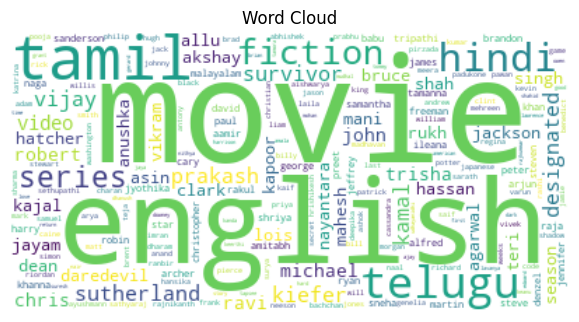

#### *Every story is complicated until it finds the right storyteller — Anonymous*

# Data-Driven Insights from Media Dataset Analysis

## Introduction
The analysis of the **media.csv** dataset encompassing 2,652 entries provides valuable insights into the diverse landscape of films and media. This narrative highlights key observations, statistical analyses, and actionable recommendations gleaned from the dataset.

## Word Cloud Analysis

*The word cloud visually summarizes the most frequent words related to films, showcasing significant themes.*

### Key Observations:
1. **Dominant Words**: The word "movie" is the most prominent, indicating a film-centric focus.
2. **Language Diversity**: Terms like "English," "Tamil," and "Telugu" indicate a multilingual landscape in the media sector.
3. **Temporal Elements**: Presence of month abbreviations suggests temporal relevance, perhaps in relation to release dates or events.
4. **Varied Genres**: Mentions of genres (e.g., "fiction," "non-fiction") imply a wide spectrum of content types.
5. **Notable Names**: References to various actors/directors point to the interplay of celebrity culture and media narrative.

---

## Automated Data Assessment Report

### Overview of the Dataset
- **Total Entries**: 2,553 (for analysis, excluding missing data)
- **Unique Dates**: 2,055
- **Languages Represented**: 11
- **Types of Media**: 8
- **Most Frequent Language**: English with 1,306 entries
- **Highest Rated Title**: *Kanda Naal Mudhal* with 9 occurrences

### Summary Statistics
| Metric            | Overall Rating | Quality Rating | Repeatability Rating |
|-------------------|----------------|-----------------|----------------------|
| Count              | 2,652          | 2,652           | 2,652                |
| Mean               | 3.05           | 3.21            | 1.49                 |
| Standard Deviation | 0.76           | 0.80            | 0.60                 |
| Minimum            | 1.00           | 1.00            | 1.00                 |
| Maximum            | 5.00           | 5.00            | 3.00                 |

### Missing Values Report
| Field            | Missing Values Count | Missing Percentage (%) |
|------------------|---------------------|-------------------------|
| Date             | 99                  | 3.73%                   |
| Creator (By)     | 262                 | 9.88%                   |

---

## Correlation Analysis

### Insights
From the correlation matrix:

| Variables         | Overall  | Quality  | Repeatability |
|-------------------|----------|----------|---------------|
| Overall           | 1.000    | 0.826    | 0.513         |
| Quality           | 0.826    | 1.000    | 0.312         |
| Repeatability     | 0.513    | 0.312    | 1.000         |

1. **Quality and Overall Ratings**: A strong positive correlation (0.826) indicates that enhancing the quality of content will likely elevate overall ratings.
2. **Repeatability**: Moderate correlation (0.513) suggests that improving repeatability efforts could enhance overall perceptions but with a lesser impact.
3. **Weak link between Quality and Repeatability**: The correlation of 0.312 implies independent improvement opportunities in these metrics.

### Actionable Recommendations
1. **Enhance Content Quality**: Invest in higher production values to improve viewer satisfaction and overall ratings.
2. **Focus on Consistency**: Creating reliable repeat experiences can improve viewer retention.
3. **Tailored Strategies for Metrics**: Due to the weak correlation, treat quality improvement and repeatability enhancement as distinct efforts.

---

## Outlier Detection

### Insights from Outlier Analysis
1. **Identify Outliers**: Using approaches such as IQR and Z-Score, we determine points that differ significantly from the norm.
   
2. **Impact on Statistics**: Outliers can skew mean values significantly, emphasizing the need for careful validation or exclusion in analysis.

### Recommendations
- **Validate Outliers**: Investigate detected points to ascertain whether they denote true analytical anomalies or data collection errors.
- **Adapt Future Collection Strategy**: Structuring data collection to minimize outlier occurrences and improve reliability.

---

## Categorical Data Distribution Insights
### Distribution Graphs
- 
- 
- 

### Key Insights:
1. **Popular Content Types**: A significant frequency in the "movie" category indicates its centrality to user engagement.
2. **Diverse Language Representation**: An emphasis on English suggets a market opportunity to cater to non-English-speaking audiences.
3. **Temporal Trends**: Analyzing the frequency over the year may offer insights into seasonal content trends.

### Action Items
- **Consider demographic outreach** for increasing visibility in less represented languages.
- **Utilize trending topics and seasons** to enhance content releases and audience engagement.

---

## Conclusion
The analysis of this media dataset unveils crucial insights into user preferences, content performance, and market dynamics. 

### General Insights:
- Invest in improving quality to elevate overall ratings.
- Ensure that repeatability strategies are emphasized for enhanced viewer loyalty.
- Monitor and manage outliers and missing data proactively to boost analysis accuracy.

By implementing these recommendations, companies within the film and media industry can make informed decisions that enhance customer satisfaction, improve product offerings, and ultimately drive growth. For more details on data-driven storytelling, consider exploring resources from [DataCamp](https://www.datacamp.com) or [Towards Data Science](https://towardsdatascience.com).
