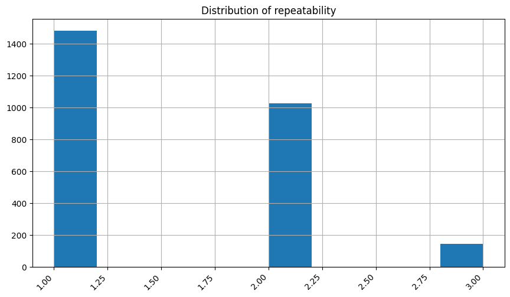

*Every story is complicated until it finds the right storyteller — Anonymous*

# Summary of findings

## Overview
File name: media.csv

The file has 2652 rows and 8 columns

### Sample 5 rows from file, for context

Sample data:
| language   | type   | title                | by                                              |
|:-----------|:-------|:---------------------|:------------------------------------------------|
| Tamil      | movie  | Gethu                | Udhayanidhi Stalin, Sathyaraj                   |
| English    | movie  | Ant-Man and the Wasp | Paul Rudd, Michael Douglas                      |
| English    | movie  | Sin City             | Bruce Willis, Jessica Alba                      |
| Hindi      | movie  | Bala                 | Ayushmann Khurrana, Yami Gautam, Bhumi Pednekar |
| Hindi      | movie  | Sarkar               | Abhishek Bachchan, Amitabh Bachchan             |

### Descriptive analysis of the data

|       |   overall |   quality |   repeatability |
|:------|----------:|----------:|----------------:|
| count |   2652    |   2652    |         2652    |
| mean  |      3.05 |      3.21 |            1.49 |
| std   |      0.76 |      0.8  |            0.6  |
| min   |      1    |      1    |            1    |
| 25%   |      3    |      3    |            1    |
| 50%   |      3    |      3    |            1    |
| 75%   |      3    |      4    |            2    |
| max   |      5    |      5    |            3    |

## Missing values report

|               |   Missing Values Count |   Missing Percentage (%) |
|:--------------|-----------------------:|-------------------------:|
| date          |                     99 |                  3.73303 |
| language      |                      0 |                  0       |
| type          |                      0 |                  0       |
| title         |                      0 |                  0       |
| by            |                    262 |                  9.87934 |
| overall       |                      0 |                  0       |
| quality       |                      0 |                  0       |
| repeatability |                      0 |                  0       |

### Word Cloud Analysis

Some of these most frequently words are: movie, english, tamil, telugu, hindi, fiction, series, vijay, prakash, kamal, sutherland, survivor, kiefer, designated, video, trisha, john, michael, robert, ravi.

This heatmap visualizes the correlation between numerical features.

This boxplot highlights potential outliers for numerical features.

### Outlier Summary:

|                |   overall |   quality |   repeatability |
|:---------------|----------:|----------:|----------------:|
| lower_bound    |      -0.5 |       1.5 |            -0.5 |
| upper_bound    |       6.5 |       5.5 |             3.5 |
| outliers_count |       0   |      24   |             0   |

### Time Series Analysis

This line plot shows trends over time for numerical data with a `Date` column.

<!--### Geographic Distribution
No geographic data found
-->

<!--### Network Analysis
No network analysis generated
-->

### Categorical Data Distribution
The following plots show the distribution of categorical data:

This bar chart shows the distribution of `date` column.

Sample 5 rows from provided data, for context to Categorical distribution 
| date      |
|:----------|
| 14-Mar-11 |
| 25-Jul-22 |
| 29-May-12 |
| 17-Dec-11 |
| 25-Mar-17 |

This bar chart shows the distribution of `language` column.

Sample 5 rows from provided data, for context to Categorical distribution 
| language   |
|:-----------|
| English    |
| Tamil      |
| English    |
| English    |
| Telugu     |

This bar chart shows the distribution of `type` column.

Sample 5 rows from provided data, for context to Categorical distribution 
| type   |
|:-------|
| movie  |
| movie  |
| movie  |
| movie  |
| movie  |

### Numerical Data Histograms

This histogram plot represents the distribution of `overall` column.

This histogram plot represents the distribution of `quality` column.

This histogram plot represents the distribution of `repeatability` column.

This scatter plot represents the cluster analysis results.

Sample data with clusters:

| date      | language   | type   | title                   | by                                 |   overall |   quality |   repeatability |   Cluster |
|:----------|:-----------|:-------|:------------------------|:-----------------------------------|----------:|----------:|----------------:|----------:|
| 11-Jan-08 | Tamil      | movie  | Kannamoochi Yenada      | Prithviraj, Sathyaraj              |         4 |         4 |               2 |         0 |
| 18-Nov-18 | Tamil      | movie  | Kathi Sandai            | Vishal                             |         2 |         2 |               1 |         1 |
| 16-Mar-17 | Telugu     | movie  | Bruce Lee The Real Hero | Ram Charan Teja, Rakul Preet Singh |         2 |         3 |               1 |         1 |
| 12-Oct-05 | English    | movie  | Charade                 | Cary Grant, Audrey Hepburn         |         4 |         4 |               3 |         0 |
| 04-Dec-16 | Hindi      | movie  | Kahaani                 |                                    |         4 |         5 |               2 |         0 |

This scatter plot shows the PCA results.

