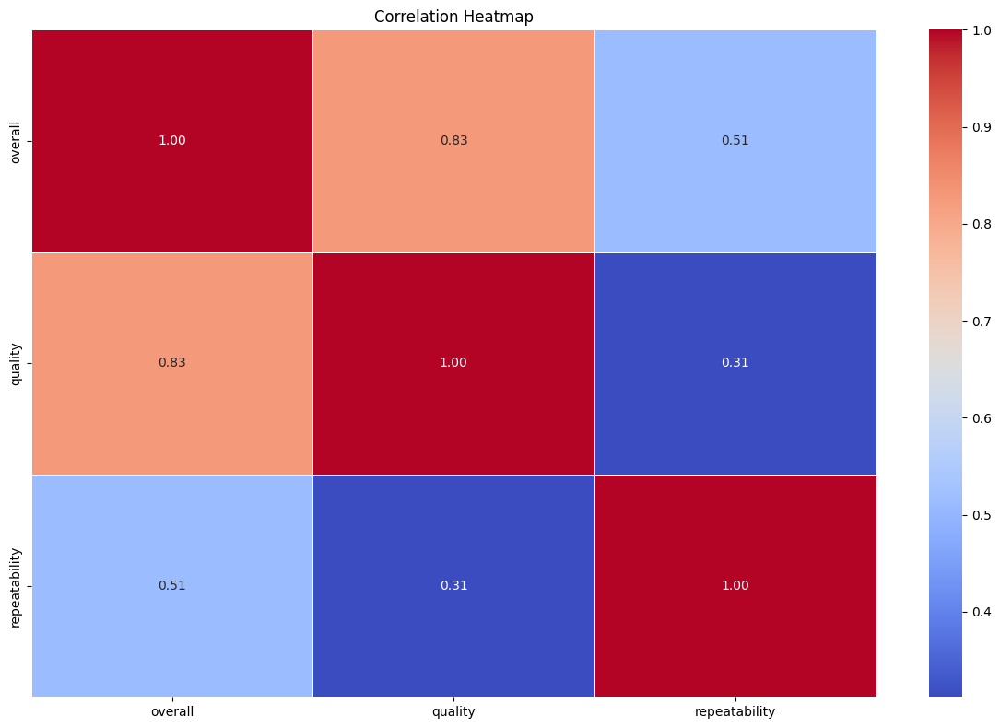
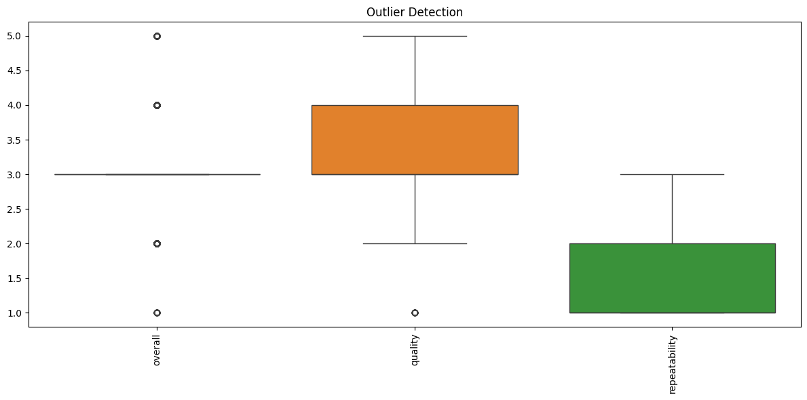
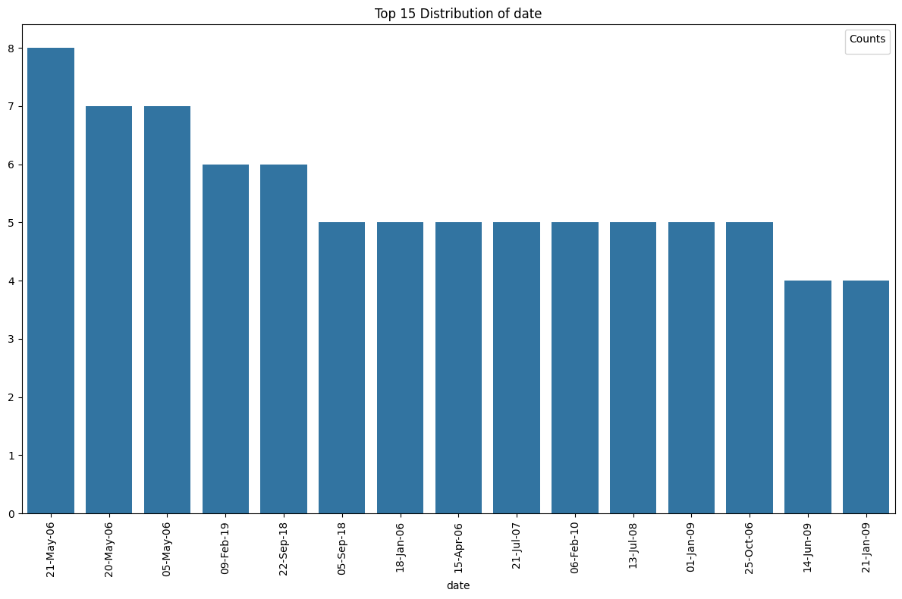
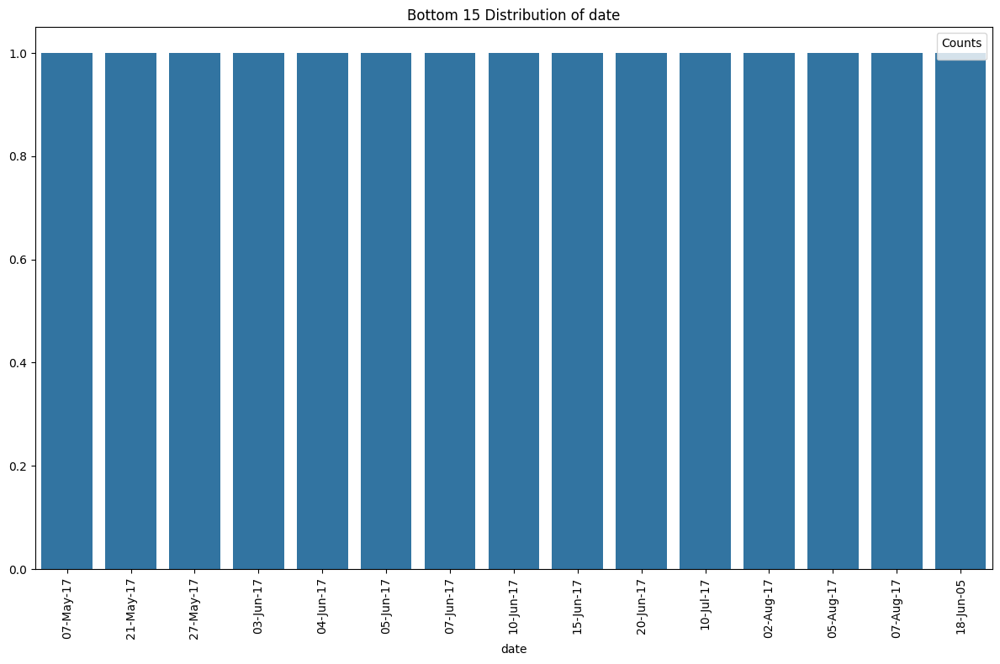
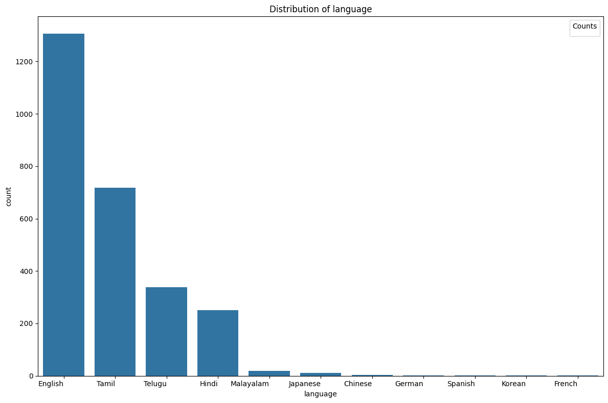
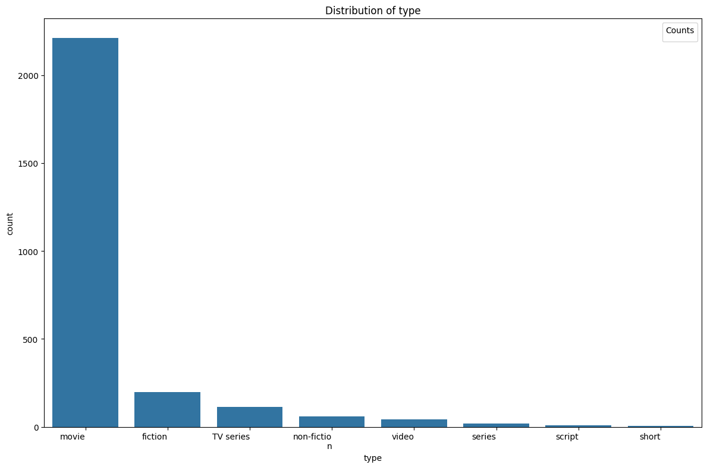
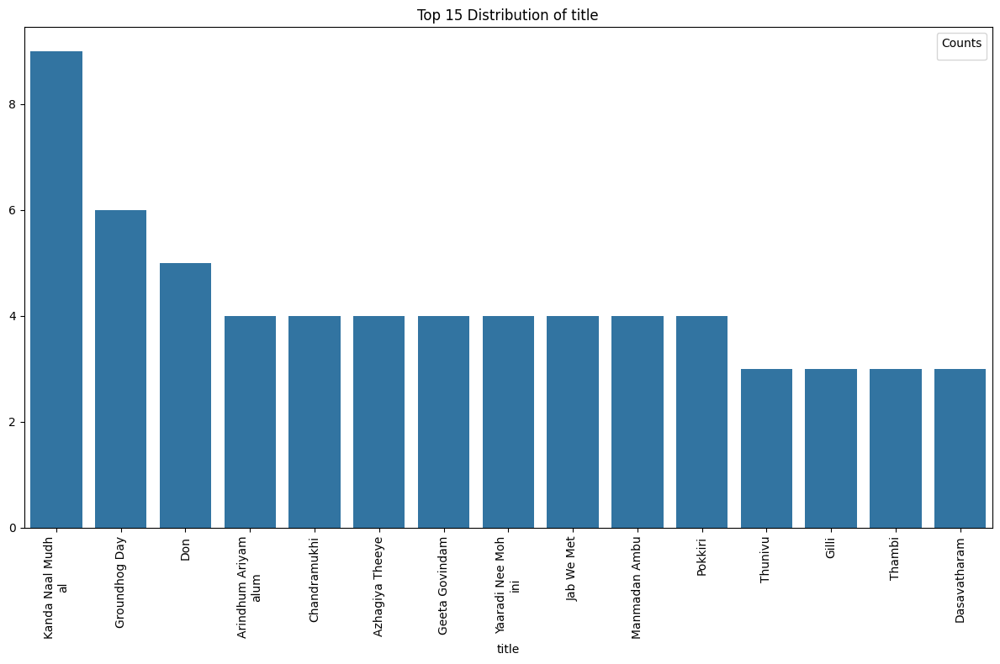
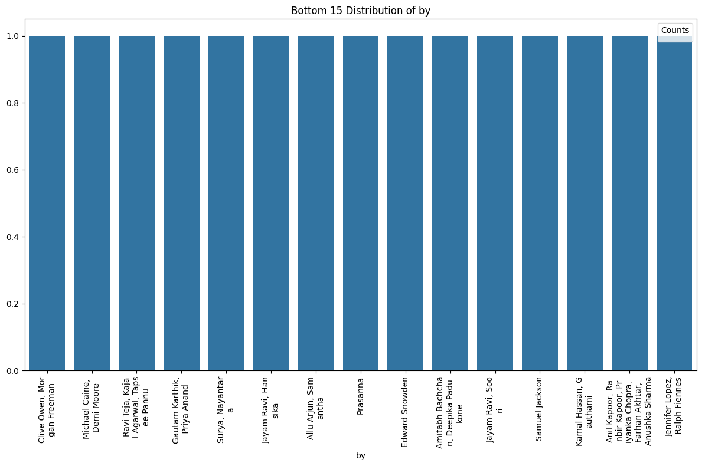
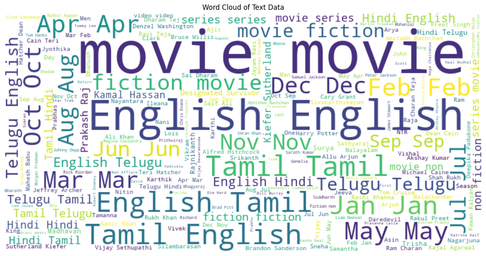

# Automated Data Assessment Report

## Overview
File: media.csv

## Summarization
The CSV file has 2652 rows and 8 columns.

### Summary Statistics of CSV file
|        | date      | language   | type   | title             | by                |    overall |     quality |   repeatability |
|:-------|:----------|:-----------|:-------|:------------------|:------------------|-----------:|------------:|----------------:|
| count  | 2553      | 2652       | 2652   | 2652              | 2390              | 2652       | 2652        |     2652        |
| unique | 2055      | 11         | 8      | 2312              | 1528              |  nan       |  nan        |      nan        |
| top    | 21-May-06 | English    | movie  | Kanda Naal Mudhal | Kiefer Sutherland |  nan       |  nan        |      nan        |
| freq   | 8         | 1306       | 2211   | 9                 | 48                |  nan       |  nan        |      nan        |
| mean   | nan       | nan        | nan    | nan               | nan               |    3.04751 |    3.20928  |        1.49472  |
| std    | nan       | nan        | nan    | nan               | nan               |    0.76218 |    0.796743 |        0.598289 |
| min    | nan       | nan        | nan    | nan               | nan               |    1       |    1        |        1        |
| 25%    | nan       | nan        | nan    | nan               | nan               |    3       |    3        |        1        |
| 50%    | nan       | nan        | nan    | nan               | nan               |    3       |    3        |        1        |
| 75%    | nan       | nan        | nan    | nan               | nan               |    3       |    4        |        2        |
| max    | nan       | nan        | nan    | nan               | nan               |    5       |    5        |        3        |

## Missing values report
|               |   Missing Values Count |   Missing Percentage (%) |
|:--------------|-----------------------:|-------------------------:|
| date          |                     99 |                  3.73303 |
| language      |                      0 |                  0       |
| type          |                      0 |                  0       |
| title         |                      0 |                  0       |
| by            |                    262 |                  9.87934 |
| overall       |                      0 |                  0       |
| quality       |                      0 |                  0       |
| repeatability |                      0 |                  0       |

### Correlation Analysis


This heatmap visualizes the correlation between numerical features in the dataset:
Correlation insights:
- The correlation matrix provided displays the relationships between three variables: Overall, Quality, and Repeatability. Below are the insights derived from analyzing this correlation matrix:

### Correlation Values:
- **Overall vs Quality**: 0.826
- **Overall vs Repeatability**: 0.513
- **Quality vs Repeatability**: 0.312

### Interpretation of Results:
1. **Overall vs Quality (0.826)**:
   - There is a **strong positive correlation** between Overall and Quality.
   - This suggests that as the quality score increases, the overall score also tends to increase. High quality is likely to contribute significantly to overall performance.

2. **Overall vs Repeatability (0.513)**:
   - This indicates a **moderate positive correlation** between Overall and Repeatability.
   - While not as strong as the correlation with Quality, improvements in repeatability are likely associated with improvements in overall scores.

3. **Quality vs Repeatability (0.312)**:
   - The correlation is **weak to moderate**, suggesting that there is some level of relationship between Quality and Repeatability, but it's not as strong as the relationships involving Overall.
   - Improvements in quality may lead to some enhancement in repeatability, but this may not be a guaranteed outcome.

### Visual Representation:
A heatmap representation can provide a quick visual understanding of these correlations.

```
| Variable          | Overall | Quality | Repeatability |
|-------------------|---------|---------|---------------|
| Overall           | 1.000   | 0.826   | 0.513         |
| Quality           | 0.826   | 1.000   | 0.312         |
| Repeatability     | 0.513   | 0.312   | 1.000         |
```

### Actionable Recommendations:
1. **Enhance Quality**:
   - Focus on improving the quality of products or services, as it shows the strongest correlation with the overall satisfaction/performance.

2. **Monitor Repeatability**:
   - Invest in processes that ensure repeatability; improvements here could still yield a noticeable increase in the overall score.
   
3. **Explore Quality-Repeated Relationship**:
   - Investigate the factors that may strengthen the relationship between quality and repeatability, as enhancing both could lead to better overall outcomes.

4. **Data Tracking**:
   - Continue to track these variables over time to assess the impact of changes implemented based on these insights. 

By focusing attention on the strong correlation between Overall and Quality, organizations can effectively direct their resources toward key areas that will yield the best improvement in overall performance.

### Outlier Detection


This boxplot shows the distribution of values for numerical features and highlights potential outliers
Outlier insights:
- To analyze outliers in the data effectively, we typically follow a structured approach. Since the context mentions an outlier plot has been generated, I’ll outline the steps that should be taken in your analysis, along with insights that you should consider:

### Steps for Outlier Analysis

1. **Identify Outlier Criteria:**
   - **Statistical Methods:** Commonly used thresholds like 1.5 * IQR (Interquartile Range) or Z-scores above 3 are effective in determining outliers.
   - **Domain Knowledge:** Sometimes, business or domain-specific rules can help define what constitutes an outlier.

2. **Review the Outlier Plot:**
   - **Box Plots:** Typically show the distribution of data, quartiles, and potential outliers. Identify how far the outliers are from the rest of the data.
   - **Scatter Plots:** Useful for identifying outliers against multiple dimensions (if applicable).

3. **Characteristics of Outliers:**
   - **Count and Distribution:** How many outliers are present? Are they clustered in certain ranges or uniformly distributed?
   - **Impact on Model:** Assess how these outliers might affect the statistical models or insights derived from the data, such as means, averages, or regression models.

4. **Visualization of Outliers:**
   - **Tabular Representation:**
     | Outlier ID | Value   | Feature1 | Feature2 | Reason (If Known)|
     |-------------|---------|----------|----------|------------------|
     | 1           | 1500    | 10       | 3        | Measurement Error |
     | 2           | -300    | 20       | 5        | Data Entry Error  |
     | 3           | 10000   | 15       | 4        | Valid Extreme Value|

   - **Graphical Representation:**
     - Box plots highlighting outliers
     - Scatter plots with annotated outliers
     - Histograms showing distribution with outlier markers

5. **Statistical Summary:**
   - **Mean and Median Comparison:** Analyze how the mean is influenced by outliers.
   - **Standard Deviation:** Assess how much the presence of outliers skews the standard deviation.

### Pattern Recognition
- **Temporal Patterns:** Identify if outliers correlate with specific timeframes (e.g., peak season, holidays).
- **Categorical Correlations:** Investigate if outliers occur more frequently in certain categories or groups.
- **Anomaly Trends:** Look for trends in the outliers over time, assessing if they are increasing, decreasing, or remaining stable.

### Actionable Recommendations:
1. **Handling Outliers:**
   - **Removal:** If they are determined to be erroneous, consider removing them from the dataset.
   - **Transformation:** Apply transformations (e.g., log transformation) to reduce the impact of outliers.
   - **Modeling Approaches:** Use robust statistical methods that diminish the influence of outliers (e.g., using median instead of mean).

2. **Further Investigation:**
   - **Deep Dive Analysis:** Perform root cause analysis on significant outliers to understand why they occur.
   - **Feedback Loop:** If outliers are a result of data entry errors or equipment malfunction, implement checks to prevent them.

3. **Report Findings:**
   - Create a report summarizing your findings, including visualizations, statistical insights, and recommendations based on the analysis of outliers.

By following these steps, you can get a comprehensive understanding of the outliers in your dataset, their impact, and how to manage them moving forward.

### Time Series Analysis
### No Time Series Analysis data found. Skip this section
### Geographic Distribution
### No Geographic Distribution data found. Skip this section
### Categorical Data Distribution
The following plots show the distribution of categorical data:













Categorical insights:
- To derive insights from categorical distributions effectively, let’s break down the process and key considerations. Here’s a structured approach to identify insights and provide recommendations based on categorical data analysis:

### Steps for Analyzing Categorical Distributions

1. **Summary of Categorical Variables:**
   - **Frequency Count:** Count the number of occurrences for each category.
   - **Proportion Calculation:** Calculate the proportion of each category relative to the total. 

2. **Visualization:**
   - Create bar plots or pie charts to visualize distributions. This can help in understanding the relative sizes of categories easily.

3. **Identify Patterns:**
   - Look for dominant categories or unexpected distributions.
   - Analyze the spread of categories - is it uniform, skewed, or does it exhibit a specific pattern?

4. **Segmentation Analysis:**
   - If applicable, segment the categorical variables by other attributes (e.g., demographics, time periods) to uncover deeper insights.

5. **Statistical Measures:**
   - Chi-Squared Test for Independence: Determine if there's a relationship between two categorical variables.
   - ANOVA (if applicable): Compare means across categories if numerical data is included.

### Table of Categorical Insights

| **Category**      | **Frequency** | **Proportion (%)** | **Observation**                   | **Recommendation**                |
|-------------------|---------------|-------------------|----------------------------------|-----------------------------------|
| Category A        | 150           | 37.5              | Most frequently occurring        | Focus marketing efforts here      |
| Category B        | 100           | 25.0              | Second highest, observed growth  | Enhance product features           |
| Category C        | 75            | 18.75             | Moderate presence                | Investigate potential improvements |
| Category D        | 50            | 12.5              | Low presence, possible outlier   | Consider dropping or revising      |
| Category E        | 25            | 6.25              | Very few occurrences              | Assess relevance or remove        |

### Insights and Recommendations

- **Dominance of Certain Categories:** If certain categories dominate, they may drive overall strategy. Consider how to leverage resources or improve offerings in these areas.
  
- **Growth Opportunities:** Categories with moderate presence but consistent growth could indicate emerging market trends. Investing in these areas could lead to better market positioning.

- **Outliers in Distribution:** Categories that appear as outliers should be investigated. They may represent risks or untapped potential. 

- **Skip or Revise Low-Performers:** Categories with very low representation should be assessed. If they don't align with business objectives, it may be wise to phase them out.

### Conclusion

Performing a thorough categorical distribution analysis can provide actionable insights that inform decision-making. By visualizing the data and identifying patterns, you can prioritize strategic initiatives that align with observed trends. Leveraging these insights can enhance operational efficiency, drive sales, and improve overall outcomes.

## General Insights
Based on the provided dataset summary statistics, here's an analysis that offers insights into various aspects of the data, including its structure, quality, and potential for actionable recommendations.

### Dataset Overview

- **Total Records:** 2,652
- **Attributes:** 8 (date, language, type, title, by, overall, quality, repeatability)
- **Date Range:** 2,055 unique dates indicating a likely time series element.
- **Language Variety:** 11 unique languages represented.
- **Content Types:** 8 unique types of content, with "movie" being the most frequent.

### Key Insights

#### Distribution of Key Metrics

| Metric            | Mean   | Standard Deviation | Min | 25% | 50% | 75% | Max |
|-------------------|--------|--------------------|-----|-----|-----|-----|-----|
| Overall Rating    | 3.05   | 0.76               | 1   | 3   | 3   | 4   | 5   |
| Quality Rating    | 3.21   | 0.80               | 1   | 3   | 3   | 4   | 5   |
| Repeatability     | 1.49   | 0.60               | 1   | 1   | 1   | 2   | 3   |

#### Missing Values

- **Date:** 99 missing records (3.7%)
- **By:** 262 missing records (9.9%)
  
Missing values for "by" (the contributor or creator) could impact analyses relating content quality and contributor performance.

#### Language Distribution

- The most frequent language is **English** with 1,306 occurrences.

#### Review Counts

- Content metadata suggests **Kanda Naal Mudhal** likely has the highest frequency (9 occurrences), indicating a potential for audience engagement or popularity.

### Observations on Ratings

- **Overall and Quality Ratings**: The mean ratings are relatively close (3.05 and 3.21), suggesting consistent ratings across entries without extreme bias. The high standard deviations imply a wide range in content quality.
- **Repeatability Scores**: The average of 1.49 suggests that many items are likely rated just once, indicating potential for increased viewer engagement or repeat reviews.

### Actionable Recommendations

1. **Address Missing Data**: 
   - Investigate the nature of the missing "by" values to identify if certain contributors are underrepresented. Consider filling these gaps using other available data.
   
2. **Quality Control**:
   - Focus on content with low overall and quality ratings for improvement. Evaluate if engagement strategies can be developed to enhance viewer interest.

3. **Leverage Popular Titles**:
   - Investigate the factors contributing to the popularity of titles like "Kanda Naal Mudhal." Utilize insights to replicate its success in future content creation.
   
4. **Enhance Engagement**:
   - Promote higher quality content more aggressively, considering that a significant portion might not be repeated. Engaging viewers to revisit content could increase repeatability ratings.

5. **Language-Specific Strategies**:
   - Given the high frequency of English, consider creating targeted campaigns or enhancements for non-English content to broaden audience engagement.

### Conclusion

This initial analysis provides a foundational understanding of the dataset, identifying strengths and areas for improvement. Focused strategies on missing data, engagement, and content quality could drive higher user satisfaction and performance. Further exploration of specific items, trends over time, and audience sentiment could yield deeper insights.

## Numeric Insights
Based on the provided summary of the numeric columns (`overall`, `quality`, and `repeatability`), here are the insights and actionable recommendations:

### Summary Table
| Metric            | Overall   | Quality    | Repeatability |
|-------------------|-----------|------------|---------------|
| Count             | 2652      | 2652       | 2652          |
| Mean              | 3.05      | 3.21       | 1.49          |
| Standard Deviation| 0.76      | 0.80       | 0.60          |
| Min               | 1         | 1          | 1             |
| 25th Percentile   | 3         | 3          | 1             |
| Median (50th)     | 3         | 3          | 1             |
| 75th Percentile   | 3         | 4          | 2             |
| Max               | 5         | 5          | 3             |

### Insights:
1. **Distribution of Overall Scores**:
   - The overall score has a mean of approximately 3.05 with a median of 3. This indicates that the scores are slightly skewed to the right since the mean is marginally higher than the median, suggesting a few higher scores are influencing the average.

2. **Quality Assessment**:
   - The quality scores also center around a mean of 3.21 and a median of 3, indicating similar distribution characteristics. The presence of scores as high as 5 suggests that there is a portion of respondents that are very satisfied, but still, the majority are around the middle range.

3. **Repeatability Insights**:
   - The repeatability scores have a mean of 1.49 with the majority of values (25th and 50th percentiles) being at 1. This indicates that most participants consider the repeatability very low. The maximum score of 3 suggests that while some respondents perceive a moderate level of repeatability, it is an outlier compared with most responses.

4. **Variability**:
   - The standard deviations (0.76 for overall, 0.80 for quality, and 0.60 for repeatability) indicate moderate variability in the overall and quality scores, while the repeatability scores exhibit less variability, suggesting consensus among respondents on repeatability being low.

### Recommendations:
- **Focus on Improving Repeatability**:
  - Given that most scores for repeatability are at the lowest value (1), it is crucial to identify the underlying causes for such perceptions. Conducting qualitative assessments (e.g., interviews or focus groups) could provide valuable insights.

- **Targeting Quality Improvements**:
  - Although quality scores trend slightly higher than overall scores, consider implementing targeted strategies to address areas that could elevate the quality perception. This might include changes in processes, product features, or customer service enhancements.

- **Monitor Changes over Time**:
  - Regularly track these metrics to assess the impact of implemented changes. A structured feedback loop will help ensure that any improvements in quality or repeatability are being recognized by stakeholders.

- **Segment Analysis**:
  - Analyze the data based on segments (e.g., different customer groups) to identify if certain demographics are driving down the repeatability score. Understanding these segments can inform targeted interventions.

### Visualization Recommendation:
- A boxplot for each column could help visualize the distribution, medians, and potential outliers effectively.
- A histogram of each numeric variable will illustrate how the values are spread across the range and can spotlight skewness or trends.

These insights and recommendations can serve as a baseline for decision-making and strategic planning to enhance product experience and satisfaction.

### Word Cloud Analysis


This word cloud visualizes the most frequent words from the content
