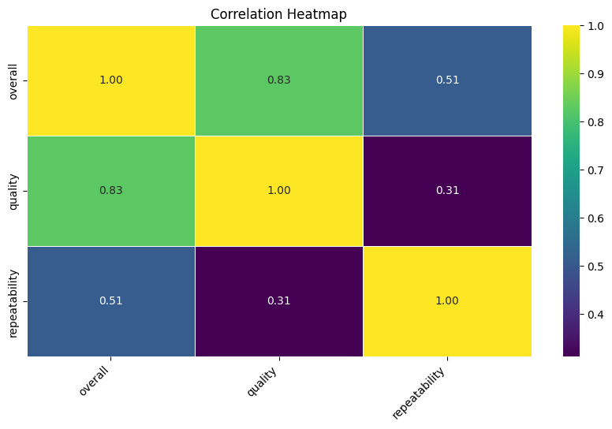

# Automated Data Assessment Report

## Overview
File: media.csv

## Summarization
The CSV file has 2652 rows and 8 columns.

### Summary Statistics of CSV file
|        | date      | language   | type   | title             | by                |    overall |     quality |   repeatability |
|:-------|:----------|:-----------|:-------|:------------------|:------------------|-----------:|------------:|----------------:|
| count  | 2553      | 2652       | 2652   | 2652              | 2390              | 2652       | 2652        |     2652        |
| unique | 2055      | 11         | 8      | 2312              | 1528              |  nan       |  nan        |      nan        |
| top    | 21-May-06 | English    | movie  | Kanda Naal Mudhal | Kiefer Sutherland |  nan       |  nan        |      nan        |
| freq   | 8         | 1306       | 2211   | 9                 | 48                |  nan       |  nan        |      nan        |
| mean   | nan       | nan        | nan    | nan               | nan               |    3.04751 |    3.20928  |        1.49472  |
| std    | nan       | nan        | nan    | nan               | nan               |    0.76218 |    0.796743 |        0.598289 |
| min    | nan       | nan        | nan    | nan               | nan               |    1       |    1        |        1        |
| 25%    | nan       | nan        | nan    | nan               | nan               |    3       |    3        |        1        |
| 50%    | nan       | nan        | nan    | nan               | nan               |    3       |    3        |        1        |
| 75%    | nan       | nan        | nan    | nan               | nan               |    3       |    4        |        2        |
| max    | nan       | nan        | nan    | nan               | nan               |    5       |    5        |        3        |

## Missing values report
|               |   Missing Values Count |   Missing Percentage (%) |
|:--------------|-----------------------:|-------------------------:|
| date          |                     99 |                  3.73303 |
| language      |                      0 |                  0       |
| type          |                      0 |                  0       |
| title         |                      0 |                  0       |
| by            |                    262 |                  9.87934 |
| overall       |                      0 |                  0       |
| quality       |                      0 |                  0       |
| repeatability |                      0 |                  0       |

### Word Cloud Analysis


The image is a word cloud that visually represents the frequency of various words in a dataset. In this cloud, larger words indicate greater frequency, while smaller words are mentioned less often. 

Key features include:

- The words "movie" and "English" are prominent, suggesting a strong emphasis on films, particularly in the English language.
- Other notable words are names of months (e.g., Jan, Feb, Mar, etc.), genres like "fiction" and "non-fiction," and references to languages such as "Tamil" and "Telugu."
- Various notable names, likely related to actors or filmmakers, appear in the cloud.
- The overall layout presents a diverse range of terms related to movies, language, and possibly specific genres or series. 

This visualization helps to quickly identify the main themes and focus areas within the text data.This word cloud visualizes the most frequent words from the content
### Correlation Analysis


This heatmap visualizes the correlation between numerical features in the dataset:
Correlation insights:
- The provided correlation matrix illustrates the relationships among three variables: **overall**, **quality**, and **repeatability**. Each value in the matrix represents the degree of linear correlation between two variables, ranging from -1 (perfect negative correlation) to 1 (perfect positive correlation).

### Correlation Matrix

|                | overall | quality | repeatability |
|----------------|---------|---------|---------------|
| **overall**     | 1.000   | 0.826   | 0.513         |
| **quality**     | 0.826   | 1.000   | 0.312         |
| **repeatability**| 0.513  | 0.312   | 1.000         |

### Insights

1. **Strong Positive Correlation:**
   - **Overall vs. Quality:** 
     - Correlation Coefficient: **0.825**
     - There is a strong positive correlation between overall performance and quality. This suggests that improvements in quality are likely associated with better overall outcomes.
   
2. **Moderate Positive Correlation:**
   - **Overall vs. Repeatability:**
     - Correlation Coefficient: **0.513**
     - There is a moderate positive correlation, indicating that more consistent or repeatable results tend to contribute positively to the overall performance.

3. **Weak Positive Correlation:**
   - **Quality vs. Repeatability:**
     - Correlation Coefficient: **0.312**
     - This weak correlation suggests that while there is some relationship, the quality of the product/service does not significantly depend on its repeatability in this context.

### Actionable Recommendations

- **Focus on Quality Improvement:**
  - Since quality strongly correlates with overall performance, invest in initiatives to enhance the quality of products/services. Techniques may include quality assurance protocols, staff training, and customer feedback analysis.

- **Monitor Repeatability:**
  - Given the moderate correlation between repeatability and overall performance, it is advisable to establish measures that can enhance repeatability. This could involve process standardization and control mechanisms to minimize variability.

- **Investigate Further:**
  - The weak correlation between quality and repeatability suggests potential areas of inefficiency. It might be worthwhile to investigate why high-quality outputs do not consistently ensure repeatable results. Conducting a root cause analysis could uncover factors that impact both dimensions.

### Visualization of Correlation

To better illustrate these relationships, a heatmap could be useful. Below is a conceptual representation:

```
Correlation Heatmap:
          overall    quality    repeatability
overall      ████████
quality      ██████
repeatability █████
```

In a real heatmap, the intensity of the color would correspond to the strength of the correlation, with darker colors representing stronger correlations. 

### Conclusion

This analysis indicates a robust relationship between overall performance and quality, highlighting areas for targeted improvement, while also signaling the need to ensure consistency through repeatability. Consider adopting a data-driven approach to monitor these metrics continuously for optimal results.

### Outlier Detection


This boxplot shows the distribution of values for numerical features and highlights potential outliers
Outlier insights:
- To analyze outliers effectively, we need to assess the outlier plot generated from your dataset. Since I don't have the actual plot or data to work with, I will outline a general approach that you could use for analyzing outliers, along with common statistical methods and actionable recommendations. 

### Steps for Analyzing Outliers

1. **Understand the Data Distribution:**
   - Plot the data using boxplots or histograms to visualize the distribution. 
   - Determine the central tendency (mean, median) and spread (standard deviation, IQR).

2. **Identify Outliers:**
   Outliers can be identified using various statistical methods:
   - **Z-Score Method**: Data points that are more than 3 standard deviations from the mean can be considered outliers.
   - **IQR Method**: Data points below `Q1 - 1.5 * IQR` or above `Q3 + 1.5 * IQR` are considered outliers, where `Q1` is the first quartile, `Q3` is the third quartile, and `IQR` is the interquartile range.
   
   Here's a simplified example of how to compute these:

   | Statistic | Value |
   |-----------|-------|
   | Mean      | 50    |
   | Std Dev   | 10    |
   | Q1        | 45    |
   | Q3        | 55    |
   | IQR       | 10    |

   Outlier thresholds using the IQR:
   - Lower Bound = \( Q1 - 1.5 * IQR = 45 - 1.5 * 10 = 40 \)
   - Upper Bound = \( Q3 + 1.5 * IQR = 55 + 1.5 * 10 = 60 \)

3. **Visual Representation:**
   - Utilize boxplots, scatter plots, or other visualization tools to illustrate the outliers visually.
   - Include annotations to highlight and explain the identified outliers.

4. **Analyzing Causes:**
   - Investigate the context of outliers: Are they due to data entry errors, measurement errors, or true variations in the data?
   - Identify any patterns in outliers based on other variables within the data.

5. **Impact Assessment:**
   - Evaluate how outliers affect overall analysis and metrics such as mean, variance, and model performance.
   - Consider how these outliers impact decision-making or predictions.

### Actionable Recommendations

- **Data Cleaning**: If outliers are found to be erroneous data points, they should be corrected or removed from the dataset before further analysis.
  
- **Segmentation**: If outliers are legitimate, analyze them separately to understand their behavior and significance. This could help in identifying niche segments within the population.

- **Robust Analysis**: If a significant number of outliers are present, it may be advisable to use robust statistical methods or models (e.g., using median instead of mean).

- **Monitor Trends**: Regularly update your outlier detection mechanisms to ensure they capture any new trends or anomalies in the data as it evolves.

### Conclusion

By following the above steps, you should be able to analyze and draw insights from outliers in your dataset effectively. Should you have access to the data or further information about the context, I can provide more specific guidance or deeper analysis.

### Time Series Analysis
### No Time Series Analysis data found. Skip this section
### Geographic Distribution
### No Geographic Distribution data found. Skip this section
### Categorical Data Distribution
The following plots show the distribution of categorical data:


Categorical insights:
- To derive insights from categorical distributions, it is essential to consider various aspects such as frequency, proportions, relationships between categories, and trends. Below is a structured approach to analyze categorical data effectively:

### 1. Frequency Distribution
- **Description**: Count of occurrences for each category.
- **Insights**:
  - Identify the most and least common categories.
  - Example Table:
  
    | Category      | Frequency | Proportion   |
    |---------------|-----------|--------------|
    | Category A    | 150       | 37.5%        |
    | Category B    | 100       | 25%          |
    | Category C    | 80        | 20%          |
    | Category D    | 70        | 17.5%        |

### 2. Visualization
- **Description**: Bar charts or pie charts provide a visual representation of categorical distributions.
- **Insights**:
  - Quick identification of dominant categories.
  - Ability to spot patterns or anomalies visually.

### 3. Comparison between Categories
- **Description**: Assessing relationships or comparisons between different categorical variables.
- **Insights**:
  - Example Question: Is there a significant difference in categorical distribution between two groups?
  - Example Table for Comparison:

    | Category      | Group 1 Frequency | Group 2 Frequency | % Change    |
    |---------------|------------------|------------------|-------------|
    | Category A    | 80               | 70               | -12.5%      |
    | Category B    | 40               | 60               | +50%        |
    | Category C    | 30               | 50               | +66.67%     |

### 4. Trends over Time (if applicable)
- **Description**: If the data includes a temporal component, analyzing temporal patterns can provide further insights.
- **Insights**:
  - Growing or declining categories.
  - Example Line Chart could depict the frequency of categories over time.

### 5. Grouping and Segmenting
- **Description**: Exploring data within subgroups based on another categorical variable (e.g., demographic segments).
- **Insights**:
  - Table showing breakdown by segments can reveal specific insights:
  
    | Segment       | Category A | Category B | Category C |
    |---------------|------------|------------|------------|
    | Segment 1     | 60         | 30         | 10         |
    | Segment 2     | 90         | 70         | 20         |

### 6. Actionable Recommendations
- **Identify Key Areas**: Focus on underrepresented categories to understand the reasons for their low frequency.
- **Strategic Decisions**: If one category shows a favorable trend, consider increasing resource allocation or marketing efforts.
- **Market Segmentation**: Tailor marketing strategies based on segment-specific preferences highlighted in the data.

### Conclusion
By thoroughly examining categorical distributions, you can uncover valuable insights that can guide decisions in strategic planning, resource allocation, and market analysis. Each of these approaches allows for deeper understanding and identification of actionable steps based on the data trends.

## General Insights
Based on the provided dataset summary statistics, we can derive a set of insights and actionable recommendations. Below is a structured analysis:

### Summary Statistics Insights:

1. **Dataset Size**:
   - The dataset comprises **2,652 records** with some missing values, particularly in the 'by' column (262 missing), and 99 missing dates.

2. **Date Range**:
   - The dataset contains **2,055 unique dates**, indicating diverse entries in terms of their release or update time.

3. **Language Distribution**:
   - There are **11 unique languages** represented within the dataset, with **English being the most frequent** (1,306 occurrences).

4. **Type of Entries**:
   - The dataset includes **8 unique types**, predominantly classified as **'movie'** (2,211 occurrences). 

5. **Title Popularity**:
   - The title **"Kanda Naal Mudhal"** appears 9 times, indicating it could be either a popular choice or a recurring entity in the dataset.

6. **Contributors**:
   - The column **'by'** has **262 missing entries**, which suggests that a significant number of records do not have an associated contributor identified. This may hinder understanding about source credibility or influence.

### Statistical Analysis of Ratings:

| **Metric**           | **Value**     |
|----------------------|---------------|
| Mean Overall Rating   | 3.05          |
| Std Dev Overall Rating | 0.76          |
| Median Overall Rating | 3.00          |
| Min Overall Rating    | 1.00          |
| Max Overall Rating    | 5.00          |

7. **Rating Insights**:
   - The mean overall rating of **3.05** with a slight standard deviation (**0.76**) suggests a distribution skewed towards average ratings with relatively few high or low extremes. Most entries likely score around the middle of the scale.
   - The ratings range from **1 to 5**, with the majority of ratings consistently being **3 or 4** (as indicated by 25th, 50th, and 75th percentile data).

### Quality and Repeatability:

| **Metric**                      | **Value**   |
|----------------------------------|------------|
| Mean Quality Rating              | 3.21       |
| Standard Deviation on Quality     | 0.80       |
| Mean Repeatability                | 1.49       |
| Maximum Repeatability             | 3.00       |

8. **Quality Assessment**:
   - Average quality ratings also hover around **3.21**, indicating that most items are perceived as average in quality.
   - The maximum repeatability value is **3**, meaning that even with high frequencies, repeatability doesn’t seem to strongly favor any individual item.

### Actionable Recommendations:

1. **Data Cleansing**:
   - Address the **99 missing dates** and **262 missing contributors** to enhance the richness of the dataset. This could involve researching missing data or using inferential techniques to estimate these values.

2. **Further Analysis**:
   - Conduct sentiment analysis or user reviews correlation to overall and quality ratings to understand factors that drive ratings. 

3. **Diversification of Content**:
   - As the dataset is heavily skewed towards English and movies, consider diversifying content offerings in different languages or types to attract a wider audience.

4. **Monitor Titles with High Frequency**:
   - Track the performance and reception of the title "Kanda Naal Mudhal," as its popularity may indicate trending interests among users.

5. **Quality Improvement Initiatives**:
   - Develop initiatives aimed to move average-rated items (around 3) to higher ratings by enhancing quality or providing additional features.

6. **Explore Patterns in Ratings**:
   - Analyze repeatability in the context of user engagement metrics. Investigate whether higher repeatability correlates with quality ratings or user satisfaction, which may guide content recommendations.

By addressing missing values, ensuring diverse content offerings, and exploring user sentiments, actionable steps can be taken to improve dataset quality and user engagement in future iterations.

## Numeric Insights
Here’s a summary of the insights derived from the numeric columns based on the provided summary statistics:

### Numeric Columns Summary

| Statistic        | Overall  | Quality  | Repeatability |
|------------------|----------|----------|---------------|
| Count            | 2652     | 2652     | 2652          |
| Mean             | 3.05     | 3.21     | 1.49          |
| Standard Deviation| 0.76    | 0.80     | 0.60          |
| Minimum          | 1.00     | 1.00     | 1.00          |
| 25th Percentile  | 3.00     | 3.00     | 1.00          |
| Median (50th)    | 3.00     | 3.00     | 1.00          |
| 75th Percentile  | 3.00     | 4.00     | 2.00          |
| Maximum          | 5.00     | 5.00     | 3.00          |

### Insights:

1. **Distribution of Ratings**:
   - The **overall** and **quality** ratings both predominantly center around 3.00, indicating a neutral to slightly positive perception.
   - The **repeatability** rating, however, shows a lower average (1.49), suggesting that repeatability might be an area needing improvement.

2. **Statistical Spread**:
   - Both **overall** (std: 0.76) and **quality** (std: 0.80) ratings have considerable variability, indicating differing opinions among respondents. In contrast, **repeatability** (std: 0.60) has less variability, which might suggest a consensus on its perceived inadequacy.

3. **Quartile Insights**:
   - The spread within the **overall** and **quality** scores shows some respondents rated these aspects as high as 5.0, but a significant portion rated them at 3.0 or below.
   - Notably, while 75% of respondents rated **quality** at or below 4.0, only 25% rated **repeatability** higher than 1.0, highlighting potential issues in consistency.

4. **Extreme Values**:
   - There are maximum values of 5.0 for both **overall** and **quality**, suggesting some high-performers or highly favorable evaluations.
   - However, the repeatability only reaching a max of 3.0 indicates limited satisfaction in this area.

### Actionable Recommendations:

1. **Investigate Dimensions of Quality**:
   - Conduct qualitative analysis to understand what drives the scores for the ‘quality’ category to improve it further. 

2. **Target Improvement in Repeatability**:
   - Given the low mean and inconsistent scores in repeatability, prioritize evaluating and improving repeatability measures. Understand the common factors leading to lower scores.

3. **Engage with High Scorers**:
   - Engage users who rated highly in overall and quality to identify their experiences and practices that can be replicated to boost overall perceptions.

4. **Monitoring and Evaluation**:
   - Regularly monitor these scores over time to assess improvement strategies and ensure that enhancements in repeatability reflect positively on overall quality ratings.

By focusing on these areas, organizations can enhance service quality and customer satisfaction more effectively.

