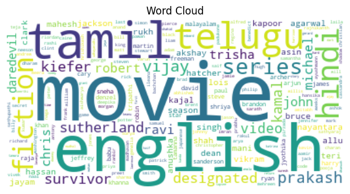
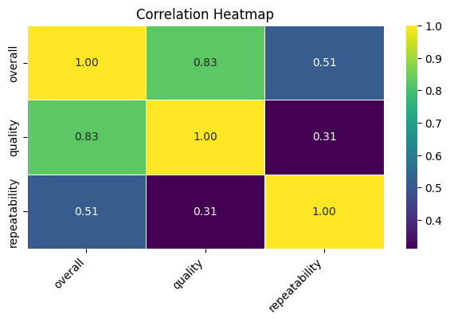
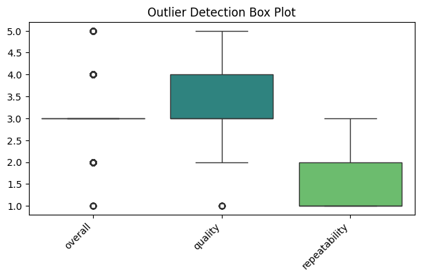
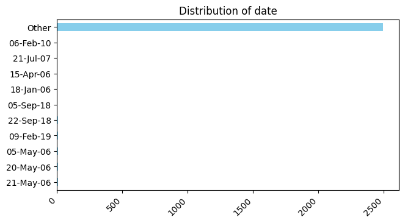
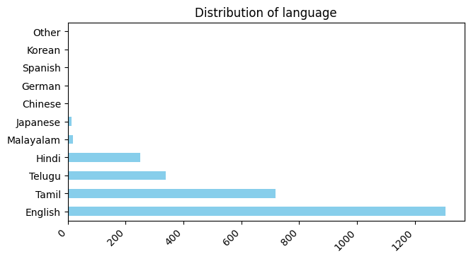
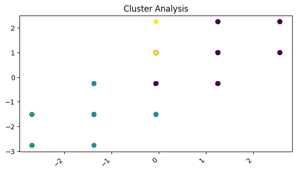
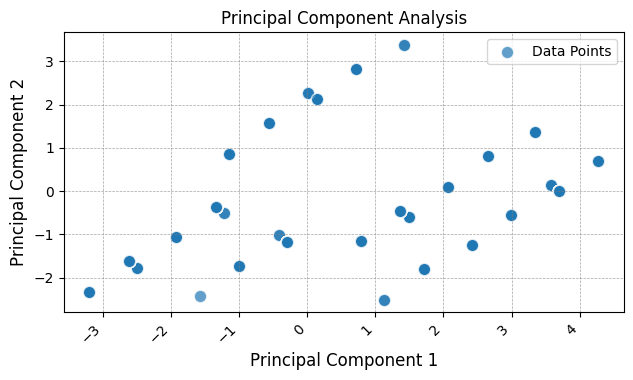

*Every story is complicated until it finds the right storyteller — Anonymous*

# Media Analysis Story: Insights from the Dataset

## Overview

In our analysis, we explored a dataset named **media.csv**, consisting of **2,652 rows** and **8 columns**. This dataset includes various forms of media, prominently featuring movies. Key columns detail the **language**, **type**, **title**, **author**, and ratings related to **overall**, **quality**, and **repeatability**. Here’s a glimpse of the data:

| Language   | Type    | Title                                                          | By                    |
|:-----------|:--------|:---------------------------------------------------------------|:----------------------|
| Tamil      | movie   | Thiruda Thirudi                                                | Dhanush               |
| English    | movie   | Ghost Rider                                                    | Nicholas Cage         |
| English    | movie   | The Chronicles Of Narnia: The Lion, The Witch And The Wardrobe |                       |
| English    | fiction | The Client                                                     | John Grisham          |
| Telugu     | movie   | Endukante Premanta                                             | Ram, Tamanna          |

## Descriptive Statistics

A summary of our findings reveals insightful perceptions:
- The **overall** average rating stands at **3.05**, while the average **quality** rating is slightly higher at **3.21**.
- The **repeatability** metric averages at **1.49**, indicating a modest trend where audiences do not frequently rewatch the same content.

## Missing Values Report

Notably, **99** entries miss the **date** field (comprising about **3.73%** of the dataset). Additionally, **262** entries lack an author credit (about **9.88%**), indicating gaps in content attribution that could be significant for analysis.

## Visual Insights

### Word Cloud Analysis

The **Word Cloud** highlights the frequency of terms, showcasing a prominent focus on languages like **English** and **Tamil**, reflecting the diversity of movies available in the dataset.

### Correlation Heatmap

The **Correlation Heatmap** illustrates strong connections between overall ratings and quality (**0.83** correlation). Strong quality leads to higher overall satisfaction. Interestingly, the correlation between quality and repeatability is weaker (**0.31**), suggesting a nuanced relationship worth exploring.

### Outlier Detection

The **Box Plot** reveals outliers in overall ratings that prompt further scrutiny, indicating potential movies that may deviate from expected performance levels.

### Categorical Data Distribution

This graph shows the temporal distribution but highlights inconsistencies due to missing date data.

The representation of languages is notably diverse, showcasing how various films attract different audience segments.

### Clustering Analysis

The **Cluster Analysis** delineates groups within the dataset, indicating similar ratings and characteristics, providing avenues for targeted recommendations or marketing strategies.

### Principal Component Analysis

The **PCA** visualization helps elucidate the relationships between the dataset's multiple variables, aiding in understanding complex media attributes.

## Insights and Anomalies

### Importance of Quality and Viewer Engagement

1. **Balance Between Quality and Repeatability**: While high-quality ratings improve overall scores, they do not guarantee increased rewatching. This suggests that viewer attention is influenced by emotional engagement or genre, which dictates whether a film is revisited.

2. **Targeted Marketing Opportunities**: Clustering insights can drive specialized marketing strategies for well-rated films, optimizing engagement and increasing viewership.

### Implications of Findings

1. **Industry Guidance**: The entertainment sector can use these insights to clarify viewer preferences, tailoring content to chic and niche audience segments.

2. **Improving Viewer Experience**: Investing in content quality can significantly enhance viewer satisfaction and loyalty.

3. **Data Expansion for Future Analysis**: Efforts to increase the diversity of languages and collect more details on viewer sentiment would enrich future analyses.

4. **Segmentation for Content Creation**: Noticing that English and Tamil have significant representation opens doors for filmmakers to target these demographics more intensely.

## Conclusion

The intersection of quality, ratings, and viewer engagement is pivotal for media entities aiming to improve audience interaction. Recognizing and addressing identified gaps enhances the scope for future projects and can help maintain relevance within a competitive entertainment landscape. This analysis not only reveals current trends but also highlights actionable recommendations for enhancing the experience for diverse audiences.

By securing aligned quality with customer expectations, organizations can elevate their market positions and drive revenue forward.

## Next Steps
- Explore underlying reasons for the anomalies in viewer engagement.
- Consider audience surveys to gather sentiment data and refine understanding of viewer preferences.
- Maintain an iterative approach to update and enrich dataset integrity while expanding its linguistic boundaries.

---

For more information on relevant analysis methods, consider reading [this comprehensive guide on data analytics](https://www.analyticsvidhya.com/blog/2021/04/a-comprehensive-guide-to-data-analysis-in-2021/).
